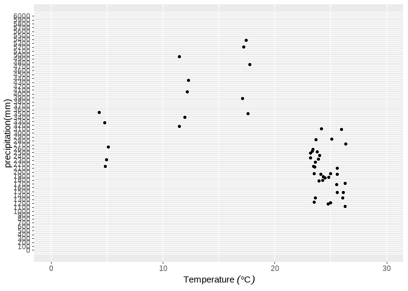

# **Class 10: Data Visualization, ggplot2**

# 1. Into the basic plotting under ggplot()

## 1.1. Library

``` r
#install.packages("ggplot2")
library(ggplot2)
```

## 1.2. Read data

``` r
Excerdt3 <- read.csv("E:/Drive/2_lab/Edu5_Course/R_MyFirstLesson/R/10_DataVisualize_ggplot2/Attachment/Excerdt3.csv")
```

## 1.3. Histogram

``` r
ggplot()+
  geom_histogram(data=Excerdt3, mapping=aes(x=Precip_value))
```


``` r
#change the color
ggplot()+
  geom_histogram(data=Excerdt3, mapping=aes(x=Precip_value), color="black")
```


``` r
#extract different color
ggplot()+
  geom_histogram(data=Excerdt3, mapping=aes(x=Precip_value), color="black", fill="#144D69")
```


``` r
#Add x lab and y lab
ggplot()+
  geom_histogram(data=Excerdt3, mapping=aes(x=Precip_value), color="black", fill="#144D69")+
  xlab("Precipitation (mm)")+
  ylab("frequency")+
  ggtitle("Frequency of precipitation")
```


``` r
# YOU can give this plot a name
His <- ggplot()+
  geom_histogram(data=Excerdt3, mapping=aes(x=Precip_value), color="black", fill="#144D69")+
  xlab("Precipitation (mm)")+
  ylab("frequency")+
  ggtitle("Frequency of precipitation")
```

## 1.4. Density plot

histograms use bars and density use lines to present the frequency.

``` r
ggplot()+
  geom_density(data=Excerdt3, mapping=aes(x=Precip_value), color="black", fill="#144D69")
```


``` r
# make the different color into different station
ggplot()+
  geom_density(data=Excerdt3, mapping=aes(x=Precip_value, fill=stationName), color="black")
```


``` r
ggplot()+
  geom_density(data=Excerdt3, mapping=aes(x=Precip_value, fill=stationName), color="black", alpha=0.3)
```


``` r
ggplot()+
  geom_density(data=Excerdt3, mapping=aes(x=Precip_value, fill=stationName), color="black", alpha=0.3)+
  xlab("Precipitation (mm)")+
  ylab("frequency")+
  ggtitle("Frequency of precipitation")
```


## 1.5. Bar plot

``` r
ggplot()+
  geom_col(Excerdt3, mapping=aes(x=stationName, y=Precip_value))
```


``` r
ggplot(Excerdt3,aes(x=stationName, y=Precip_value))+
  geom_col()
```


### 1.5.1. change the bar position

``` r
ggplot(Excerdt3,aes(x=stationName, y=Precip_value))+
  geom_col(fill="grey50", color="black")
```


``` r
ggplot(Excerdt3, aes(x=stationName, y=Precip_value, fill=as.factor(Y)))+
  geom_col(color="black")
```


``` r
ggplot(Excerdt3, aes(x=stationName, y=Precip_value, fill=as.factor(Y)))+
  geom_col(color="black", position = "dodge")
```


``` r
ggplot(Excerdt3, aes(x=stationName, y=Precip_value, fill=as.factor(Y)))+
  geom_col(color="black", position = "stack")
```


``` r
ggplot(Excerdt3, aes(x=stationName, y=Precip_value, fill=as.factor(Y)))+
  geom_col(color="black", position = "fill")
```


### 1.5.2. Change the color

``` r
ggplot(Excerdt3, aes(x=stationName, y=Precip_value, fill=as.factor(Y)))+
  geom_col(color="black", position = "dodge")+
  scale_fill_manual(name="Year", values=c("red", "blue", "yellow", "grey50", "black"))
```


``` r
ggplot(Excerdt3, aes(x=stationName, y=Precip_value, fill=as.factor(Y)))+
  geom_col(color="black", position = "dodge")+
  scale_fill_manual(name="Year", values=c("#153049", "#385487", "#25A184", "#A9D13F", "#F3E949", "#FAF6B3"))
```


### 1.5.3. Use the color palette

``` r
mypal <- colorRampPalette(c("#153049","#443A83","#287D8E","#25AB82","#98CC48","#F0E51D","#f5ed67","#FAF6B3"))
```

``` r
ggplot(Excerdt3, aes(x=stationName, y=Precip_value, fill=as.factor(Y)))+
  geom_col(color="black", position = "dodge")+
  scale_fill_manual(name="Year", values=mypal(10))# change the value of the palette
```


``` r
ggplot(Excerdt3, aes(x=stationName, y=Precip_value, fill=as.factor(Y)))+
  geom_col(color="black", position = "dodge")+
  scale_fill_manual(name="Year", values=mypal(10))+
  xlab("station")+
  ylab("precipitation(mm)")
```


``` r
Bar <- ggplot(Excerdt3, aes(x=stationName, y=Precip_value, fill=as.factor(Y)))+
  geom_col(color="black", position = "dodge")+
  scale_fill_manual(name="Year", values=mypal(10))+
  xlab("station")+
  ylab("precipitation(mm)")
```

## 1.6. Point

``` r
ggplot(Excerdt3, aes(x=averageT_value, y=Precip_value))+
  geom_point()
```


``` r
ggplot(Excerdt3, aes(x=averageT_value, y=Precip_value))+
  geom_point()+
  xlab(expression("Temperature " (degree*C)))+
  ylab("precipitation(mm)")
```


### 1.6.1 scaling the axis

``` r
ggplot(Excerdt3, aes(x=averageT_value, y=Precip_value))+
  geom_point()+
  
  scale_x_continuous(limits = c(0,30))+
  scale_y_continuous(limits= c(0, 6000))+
  
  xlab(expression("Temperature " (degree*C)))+
  ylab("precipitation(mm)")
```


``` r
ggplot(Excerdt3, aes(x=averageT_value, y=Precip_value))+
  geom_point()+
  
  scale_x_continuous(limits = c(0,30), breaks = c(0,5, 10,15, 20, 25,30))+
  scale_y_continuous(limits= c(0, 6000), breaks=c(0, 1000,2000, 3000, 4000, 5000, 6000))+
  
  xlab(expression("Temperature " (degree*C)))+
  ylab("precipitation(mm)")
```


``` r
ggplot(Excerdt3, aes(x=averageT_value, y=Precip_value))+
  geom_point()+
  
  scale_x_continuous(limits = c(0,30), 
                     breaks = seq(0,30, by=10))+
  scale_y_continuous(limits= c(0, 6000), 
                     breaks=seq(0, 6000, by=100))+
  
  xlab(expression("Temperature " (degree*C)))+
  ylab("precipitation(mm)")
```



``` r
ggplot(Excerdt3, aes(x=averageT_value, y=Precip_value))+
  geom_point()+
  
  scale_x_continuous(limits = c(0,30), 
                     breaks = seq(0,30, by=10), 
                     labels=seq(0, 3, by=1))+
  scale_y_continuous(limits= c(0, 6000), 
                     breaks=seq(0, 6000, by=1500))+
  
  xlab(expression("Temperature " (degree*C)))+
  ylab("precipitation(mm)")
```


``` r
Pointplot <- ggplot(Excerdt3, aes(x=averageT_value, y=Precip_value))+
  geom_point()+
  
  scale_x_continuous(limits = c(0,30), 
                     breaks = seq(0,30, by=10), 
                     labels=seq(0, 3, by=1))+
  scale_y_continuous(limits= c(0, 6000), 
                     breaks=seq(0, 6000, by=1500))+
  
  xlab(expression("Temperature " (degree*C)))+
  ylab("precipitation(mm)")
```

# 2. save the plot

``` r
# Export the graph
ggsave(Pointplot,filename = "Excercise_output/Pointplot_gsave.png",  width = 10, height=10, units="cm", dpi=300)
```

``` r
library(ggpubr) #install.packages("ggpubr")

ggexport(Pointplot, filename = "Excercise_output/Pointplot_gexport.png", width=3000, height=3000, res=1500)
```
