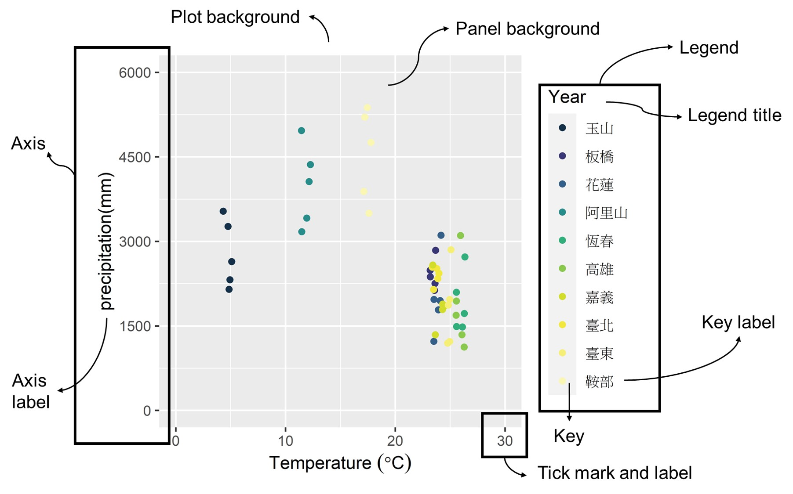

```{r include=FALSE}
library(showtext)
showtext_auto()

```


# **Class 11: Data Visualization, ggTheme**


# 1. Library

```{r message=FALSE, warning=FALSE}
library(ggplot2)
library(dplyr)
library(ggpubr)
```

# 2. Read data

```{r message=FALSE, warning=FALSE}
Excerdt3 <- read.csv("E:/Drive/2_lab/Edu5_Course/R_MyFirstLesson/R/11_DataVisualize_ggTheme/Attachment/Excerdt3.csv")

```

# 3. Review class 10

```{r message=FALSE, warning=FALSE, out.width="80%"}
#Histogram
His <- ggplot()+
  geom_histogram(data=Excerdt3, mapping=aes(x=Precip_value), 
                 color="black", fill="#144D69")+
  xlab("Precipitation (mm)")+
  ylab("frequency")+
  ggtitle("Frequency of precipitation")

#Density plot
Dens <- ggplot()+
  geom_density(data=Excerdt3, mapping=aes(x=Precip_value, fill=stationName), color="black", alpha=0.3)+
  xlab("Precipitation (mm)")+
  ylab("frequency")+
  ggtitle("Frequency of precipitation")

mypal <- colorRampPalette(c("#153049","#443A83","#287D8E","#25AB82",
                            "#98CC48","#F0E51D","#f5ed67","#FAF6B3"))

#Bar plot
Bar <- ggplot(Excerdt3, aes(x=stationName, y=Precip_value, fill=as.factor(Y)))+
  geom_col(color="black", position = "dodge")+
  scale_fill_manual(name="Year", values=mypal(10))+
  xlab("station")+
  ylab("precipitation(mm)")

# Scatter plot
Pointplot <- ggplot(Excerdt3, aes(x=averageT_value, y=Precip_value))+
  geom_point(aes(color=stationName))+
  scale_color_manual(name="Station Name", values=mypal(10))+
  scale_x_continuous(limits = c(0,30), 
                     breaks = seq(0,30, by=10), 
                     labels=seq(0, 30, by=10))+
  scale_y_continuous(limits= c(0, 6000), 
                     breaks=seq(0, 6000, by=1500))+
  
  xlab(expression("Temperature " (degree*C)))+
  ylab("precipitation(mm)")
```

```{r message=FALSE, warning=FALSE, out.width="100%"}
ggarrange(His, Dens, Bar, Pointplot, ncol=2, nrow=2)

```

# 4. Continue the basic plot under ggplot()

## 4.1 Facet wrap

```{r message=FALSE, warning=FALSE, out.width="80%"}
Point_wrap <- ggplot(Excerdt3, aes(x=averageT_value, y=Precip_value))+
  geom_point(aes(color=as.factor(stationName)))+
  scale_color_manual(name="Station Name", values=mypal(10))+
  scale_x_continuous(limits = c(0,30), 
                     breaks = seq(0,30, by=10), 
                     labels=seq(0, 30, by=10))+
  scale_y_continuous(limits= c(0, 6000), 
                     breaks=seq(0, 6000, by=1500))+
  
  xlab(expression("Temperature " (degree*C)))+
  ylab("precipitation(mm)")+
  facet_wrap(~Y)

Point_wrap


```

## 4.2 Line

```{r message=FALSE, warning=FALSE, out.width="80%"}
lineplot <- ggplot(Excerdt3, aes(x=Y, y=Precip_value, group=stationName ))+
  geom_line()

lineplot <- ggplot(Excerdt3, aes(x=Y, y=Precip_value, color=stationName ))+
  geom_line() 

lineplot <- ggplot(Excerdt3, aes(x=Y, y=Precip_value, color=stationName ))+
  geom_line()+
  geom_point(color="black", size=0.5)+
  xlab("year")+
  ylab("precipitation (mm)")

lineplot

```

## 4.3 Theme family



```{r eval=FALSE,message=FALSE, warning=FALSE}
theme(
  line,
  rect,
  text,
  title,
  aspect.ratio,
  axis.title,
  axis.title.x,
  axis.title.x.top,
  axis.title.x.bottom,
  axis.title.y,
  axis.title.y.left,
  axis.title.y.right,
  axis.text,
  axis.text.x,
  axis.text.x.top,
  axis.text.x.bottom,
  axis.text.y,
  axis.text.y.left,
  axis.text.y.right,
  axis.ticks,
  axis.ticks.x,
  axis.ticks.x.top,
  axis.ticks.x.bottom,
  axis.ticks.y,
  axis.ticks.y.left,
  axis.ticks.y.right,
  axis.ticks.length,
  axis.ticks.length.x,
  axis.ticks.length.x.top,
  axis.ticks.length.x.bottom,
  axis.ticks.length.y,
  axis.ticks.length.y.left,
  axis.ticks.length.y.right,
  axis.line,
  axis.line.x,
  axis.line.x.top,
  axis.line.x.bottom,
  axis.line.y,
  axis.line.y.left,
  axis.line.y.right,
  legend.background,
  legend.margin,
  legend.spacing,
  legend.spacing.x,
  legend.spacing.y,
  legend.key,
  legend.key.size,
  legend.key.height,
  legend.key.width,
  legend.text,
  legend.text.align,
  legend.title,
  legend.title.align,
  legend.position,
  legend.direction,
  legend.justification,
  legend.box,
  legend.box.just,
  legend.box.margin,
  legend.box.background,
  legend.box.spacing,
  panel.background,
  panel.border,
  panel.spacing,
  panel.spacing.x,
  panel.spacing.y,
  panel.grid,
  panel.grid.major,
  panel.grid.minor,
  panel.grid.major.x,
  panel.grid.major.y,
  panel.grid.minor.x,
  panel.grid.minor.y,
  panel.ontop,
  plot.background,
  plot.title,
  plot.title.position,
  plot.subtitle,
  plot.caption,
  plot.caption.position,
  plot.tag,
  plot.tag.position,
  plot.margin,
  strip.background,
  strip.background.x,
  strip.background.y,
  strip.clip,
  strip.placement,
  strip.text,
  strip.text.x,
  strip.text.x.bottom,
  strip.text.x.top,
  strip.text.y,
  strip.text.y.left,
  strip.text.y.right,
  strip.switch.pad.grid,
  strip.switch.pad.wrap
)


```

```{r message=FALSE, warning=FALSE, out.width="80%"}
Pointplot+
  # panel
  theme(panel.background = element_rect(fill="#fdf8ea"), 
        panel.grid = element_blank())

Pointplot+
        # panel
  theme(panel.background = element_rect(fill="#fdf8ea"), 
        panel.grid = element_blank(), 
        #Axis line and tick
        axis.line = element_line(color="black", linewidth=2), 
        axis.ticks = element_line(linewidth = 1.2), 
        axis.ticks.length = unit(1, "cm"))

Pointplot+
        # panel
  theme(panel.background = element_rect(fill="#fdf8ea"), 
        panel.grid = element_blank(), 
        #Axis
        axis.line = element_line(color="black", linewidth=2), 
        axis.ticks = element_line(linewidth = 1.2), 
        axis.ticks.length = unit(1, "cm"), 
        axis.title=element_text(size=20), 
        axis.text = element_text(size=10, color="grey50"), 
        axis.text.x = element_text(hjust=0.5, vjust=1),
        axis.text.y = element_text(angle = 90, hjust=0.5))

Pointplot+
        # panel
  theme(panel.background = element_rect(fill="#fdf8ea"), 
        panel.grid = element_blank(), 
        # Axis
        axis.line = element_line(color="black"), 
        axis.ticks = element_line(linewidth = 1.2), 
        axis.ticks.length = unit(1, "cm"), 
        axis.title=element_text(size=20), 
        axis.text = element_text(size=10, color="grey50"), 
        axis.text.y = element_text(angle = 90, hjust=0.5), 
        # Legend
        legend.position="right", #c("none", "top", "right", "bottom", "left")
        legend.title=element_text(size=20), 
        legend.text = element_text(size=8, color="grey50"),  
        legend.key = element_blank(), 
        legend.background=element_rect(colour = "black")) 


# Name for the plot
Pointplot2 <- Pointplot+
        # panel
  theme(panel.background = element_rect(fill="#fdf8ea"), 
        panel.grid = element_blank(), 
        # Axis
        axis.line = element_line(color="black"), 
        axis.ticks = element_line(linewidth = 1.2), 
        axis.ticks.length = unit(1, "cm"), 
        axis.title=element_text(size=20), 
        axis.text = element_text(size=10, color="grey50"), 
        axis.text.y = element_text(angle = 90, hjust=0.5), 
        # Legend
        legend.position="right", #c("none", "top", "right", "bottom", "left")
        legend.title=element_text(size=20), 
        legend.text = element_text(size=8, color="grey50"),  
        legend.key = element_blank(), 
        legend.background=element_rect(colour = "black")) 

```

## 2.7.save the plot

```{r  message=FALSE, warning=FALSE, out.width="80%"}
# Export the graph
ggsave(Pointplot2,filename = "Excercise_output/Pointplot3_gsave.png",  width = 20, height=10, units="cm", dpi=300)

```

```{r message=FALSE, warning=FALSE, out.width="80%"}
library(ggpubr) #install.packages("ggpubr")

ggexport(Pointplot2, filename = "Excercise_output/Pointplot3_gexport.png", width=3800, height=3000, res=800)
```

## 2.8.Combine the all the plot together

use ggarrange() to combine all the ggplot together. ggarrange() is the function under ggpubr package. It can be use to combine multiple figure from the ggplot output.

```{r message=FALSE, warning=FALSE}
gPloting <- ggarrange(His,Bar, lineplot, Pointplot2, 
                      ncol = 1, nrow = 4, 
                      labels = c("(a)", "(b)", "(c)", "(d)"))

ggexport(gPloting , filename = "Excercise_output/gPloting _gexport.png", width=7000, height=6000, res=500)
```
