# **Class 12: Data Visualization, geospatial**

# 1. library

``` r
library(ggplot2)
library(dplyr)
library(sf)
library(ggpubr)
```

# 2. Use ggplot to plot the geographic figure

## 2.1. Using shapefile to plot the map

### 2.1.1. Data input

``` r
Climatedt <- read.csv(
  "E:/Drive/2_lab/Edu5_Course/R_MyFirstLesson/R/12_DataVisualize_geospatial/Attachment/TaiwanClimateStationAll_202003.csv",
  fileEncoding = "Big5")

taiwan_shp <-sf::st_read(dsn ="E:/Drive/2_lab/Edu5_Course/R_MyFirstLesson/R/12_DataVisualize_geospatial/Attachment/Taiwan",
                         layer="gadm36_TWN_2")
```

    ## Reading layer `gadm36_TWN_2' from data source 
    ##   `E:\Drive\2_lab\Edu5_Course\R_MyFirstLesson\R\12_DataVisualize_geospatial\Attachment\Taiwan' 
    ##   using driver `ESRI Shapefile'
    ## Simple feature collection with 22 features and 13 fields
    ## Geometry type: MULTIPOLYGON
    ## Dimension:     XY
    ## Bounding box:  xmin: 116.71 ymin: 20.6975 xmax: 122.1085 ymax: 26.38542
    ## Geodetic CRS:  WGS 84

``` r
#head(Climatedt)
```

``` r
Climatedt1 <- Climatedt %>%
  mutate(Auto=factor(Auto, levels=c(1,0)))
```

### 2.1.2. Plot a Taiwan

With county

``` r
#1 Taiwan 
ggplot()+
  geom_sf(data=taiwan_shp)
```

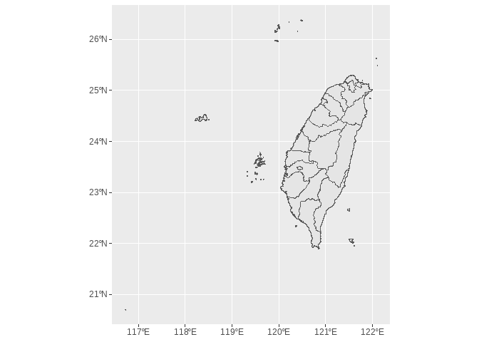

``` r
# 2 Label the county name on the map
ggplot()+
  geom_sf(data=taiwan_shp)+  
  geom_sf_text(data = taiwan_shp, aes(label = NAME_2))+
  xlab("Longitude")+
  ylab("Latitude")
```

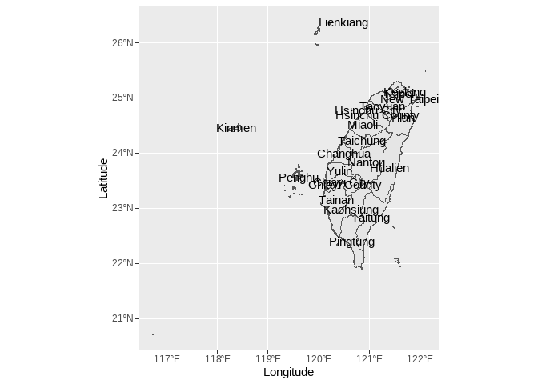

Break the county line.

``` r
taiwan2_shp <- st_union(taiwan_shp)
```

``` r
ggplot()+
  geom_sf(data=taiwan2_shp)+
  xlab("Longitude")+
  ylab("Latitude")
```

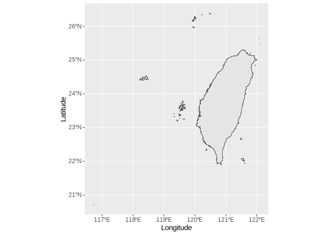

Give a name to the plot

``` r
Tai <- ggplot()+
  geom_sf(data=taiwan2_shp)+
  xlab("Longitude")+
  ylab("Latitude")
```

### 2.1.3. Put the point on the Taiwan map

``` r
Tai+
  geom_point(Climatedt, mapping=aes(x=longitude, y=latitude))
```

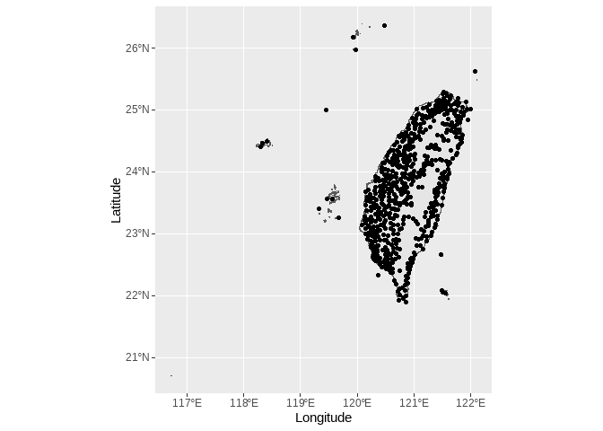

Next, we needs to clear out which are the the auto and bureau station.

``` r
# data compile
str(Climatedt)
```

    ## 'data.frame':    594 obs. of  9 variables:
    ##  $ StationNumber: chr  "466850" "466880" "466900" "466910" ...
    ##  $ StationName  : chr  "五分山雷達站" "板橋" "淡水" "鞍部" ...
    ##  $ Alt          : num  756 9.7 19 825.8 6.3 ...
    ##  $ longitude    : num  122 121 121 122 122 ...
    ##  $ latitude     : num  25.1 25 25.2 25.2 25 ...
    ##  $ County       : chr  "新北市" "新北市" "新北市" "臺北市" ...
    ##  $ Address      : chr  "瑞芳區靜安路四段1巷1號" "板橋區大觀路二段265巷62號" "淡水區中正東路42巷6號" "北投區陽明山竹子湖路111號" ...
    ##  $ datatime     : chr  "1988/7/1" "1972/3/1" "1942/1/1" "1937/1/1" ...
    ##  $ Auto         : int  0 0 0 0 0 0 0 0 0 0 ...

``` r
Climatedt1 <- Climatedt %>%
  mutate(Auto=factor(Auto, levels=c(1,0)))
```

Use different color to represent the different category of station.

``` r
Tai+
  geom_point()+
  geom_point(Climatedt1, mapping=aes(x=longitude, y=latitude, color=Auto))+
  scale_color_manual(name="Station Types",breaks=c(1, 0),values=c("#b3c145", "#321f0a"))
```

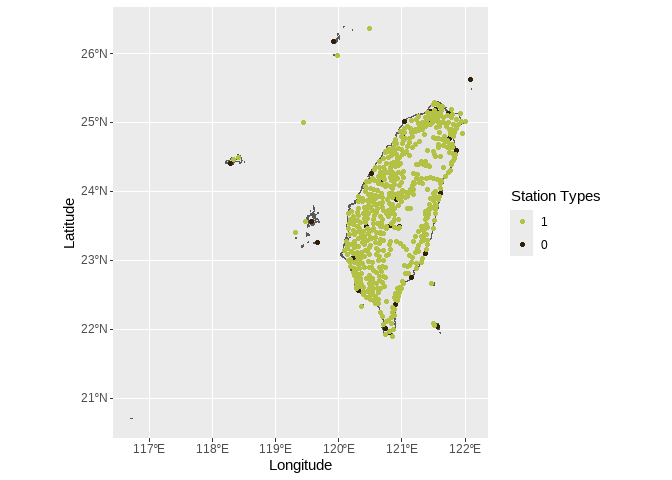

Add the different size to represent the auto and bureau station adjust
the point size

``` r
Tai+
  geom_point()+
  geom_point(Climatedt1, mapping=aes(x=longitude, y=latitude, color=Auto, size=Auto))+
  scale_color_manual(name="Station Types",breaks=c(1, 0),values=c("#b3c145", "#321f0a"))+
  scale_size_manual(name="Station Types",breaks=c(1, 0),values=c(0.9,3.0))
```

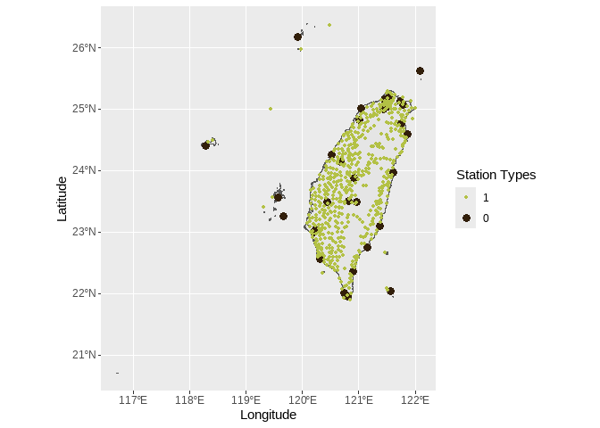

Adjust the the limit of longitude and latitude, and also adjust the CRS
(coordinate reference system)

-   WGS84 -\> EPSG:4326

-   TM2 (TWD97, 112) -\> EPSG:3826

``` r
Tai+
  geom_point()+
  geom_point(Climatedt1, mapping=aes(x=longitude, y=latitude, color=Auto, size=Auto))+
  scale_color_manual(name="Station Types",breaks=c(1, 0),values=c("#b3c145", "#321f0a"))+
  scale_size_manual(name="Station Types",breaks=c(1, 0),values=c(0.9,3.0))+
  coord_sf(xlim = c(118, 122.5), ylim = c(21.5, 26.5), crs=4326)
```

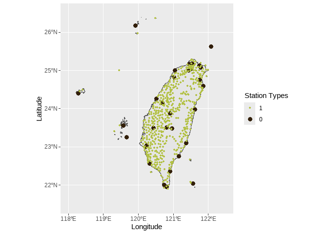

Add some decoration to the figure

``` r
# Put an arrow to the map
library(ggspatial)

Tai+
  geom_point()+
  geom_point(Climatedt1, mapping=aes(x=longitude, y=latitude, color=Auto, size=Auto))+
  scale_color_manual(name="Station Types",breaks=c(1, 0),values=c("#b3c145", "#321f0a"))+
  scale_size_manual(name="Station Types",breaks=c(1, 0),values=c(0.9,3.0))+
  coord_sf(xlim = c(118, 122.5), ylim = c(21.5, 26.5), crs=4326)+
  annotation_north_arrow(location = "tl", which_north = "true",
                         #position of the north arrow
                         pad_x = unit(0.6, "cm"), pad_y = unit(0.6, "cm"), 
                         #size and style of the north arrow
                         height = unit(1.0, "cm"), width = unit(1.0, "cm") , 
                         style = north_arrow_fancy_orienteering(text_col = 'grey10', 
                                                                line_col = 'grey10',
                                                                fill = 'grey10'))
```

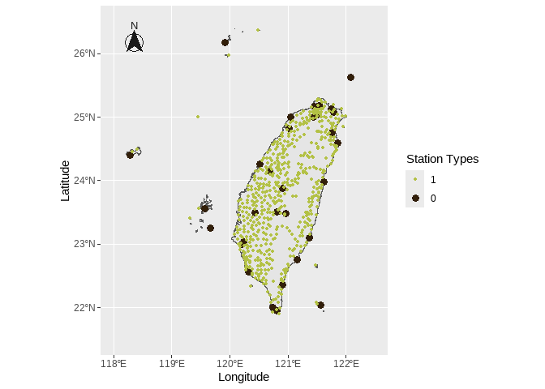

``` r
# Put a title on the map
Tai+
  geom_point()+
  geom_point(Climatedt1, mapping=aes(x=longitude, y=latitude, color=Auto, size=Auto))+
  scale_color_manual(name="Station Types",breaks=c(1, 0),values=c("#b3c145", "#321f0a"))+
  scale_size_manual(name="Station Types",breaks=c(1, 0),values=c(0.9,3.0))+
  coord_sf(xlim = c(118, 122.5), ylim = c(21.5, 26.5), crs=4326)+
  annotation_north_arrow(location = "tl", which_north = "true",
                         #position of the north arrow
                         pad_x = unit(0.6, "cm"), pad_y = unit(0.6, "cm"), 
                         #size and style of the north arrow
                         height = unit(1.0, "cm"), width = unit(1.0, "cm") , 
                         style = north_arrow_fancy_orienteering(text_col = 'grey10', 
                                                                line_col = 'grey10',
                                                                fill = 'grey10'))+
  ggtitle("Taiwan's Climate Station Map")
```

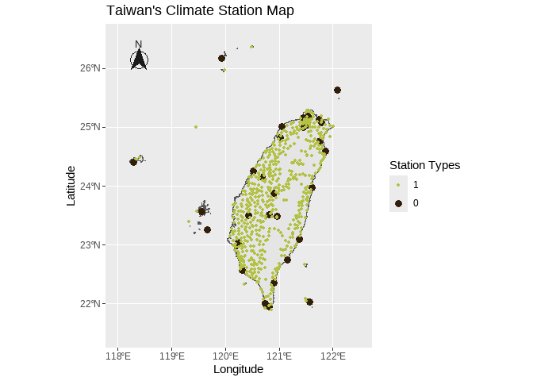

``` r
# Adjust the theme
Tai+
  geom_point()+
  geom_point(Climatedt1, mapping=aes(x=longitude, y=latitude, color=Auto, size=Auto))+
  scale_color_manual(name="Station Types",breaks=c(1, 0),values=c("#b3c145", "#321f0a"))+
  scale_size_manual(name="Station Types",breaks=c(1, 0),values=c(0.9,3.0))+
  coord_sf(xlim = c(118, 122.5), ylim = c(21.5, 26.5), crs=4326)+
  annotation_north_arrow(location = "tl", which_north = "true",
                         #position of the north arrow
                         pad_x = unit(0.6, "cm"), pad_y = unit(0.6, "cm"), 
                         #size and style of the north arrow
                         height = unit(1.0, "cm"), width = unit(1.0, "cm") , 
                         style = north_arrow_fancy_orienteering(text_col = 'grey10', 
                                                                line_col = 'grey10',
                                                                fill = 'grey10'))+
  ggtitle("Taiwan's Climate Station Map")+
  theme(panel.border = element_rect(colour = "black", fill=NA, linewidth =1.0),
        panel.background = element_rect(fill = "grey97", colour = "black"))
```

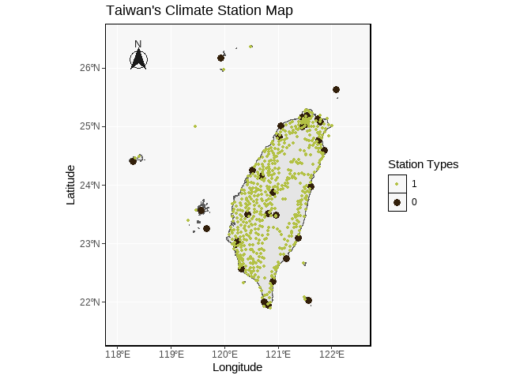

### 2.1.4. the whole code of plotting

``` r
Tai2 <- ggplot()+
  #plot something on the graph
  geom_sf(data=taiwan2_shp)+
  geom_point(Climatedt1, mapping=aes(x=longitude, y=latitude, color=Auto, size=Auto))+
  
  #scale for the color, size or axis
  scale_color_manual(name="Station Types",breaks=c(1, 0),values=c("#b3c145", "#321f0a"))+
  scale_size_manual(name="Station Types",breaks=c(1, 0),values=c(0.9,3.0))+
  coord_sf(xlim = c(118, 122.5), ylim = c(21.5, 26.5), crs=4326)+
  
  #put some text or other information
  annotation_north_arrow(location = "tl", which_north = "true",
                         #position of the north arrow
                         pad_x = unit(0.2, "cm"), pad_y = unit(0.6, "cm"), 
                         #size and style of the north arrow
                         height = unit(1.0, "cm"), width = unit(1.0, "cm") , 
                         style = north_arrow_fancy_orienteering(text_col = 'grey10', 
                                                                line_col = 'grey10',
                                                                fill = 'grey10'))+
  #labeling for the axis and tilte
  xlab("Longitude")+
  ylab("Latitude")+
  ggtitle("Taiwan's Climate Station Map")+
  
  #theme
  theme(panel.border = element_rect(colour = "black", fill=NA, linewidth =1.0),
        panel.background = element_rect(fill = "grey97", colour = "black"))

Tai2
```

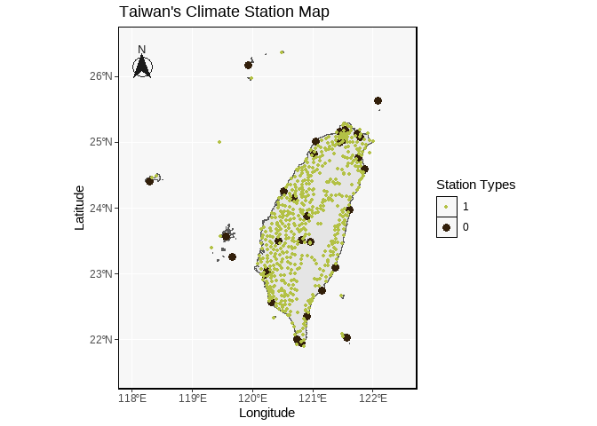

### 2.1.5. export the plot

``` r
ggexport(Tai2, filename = "Taiwan CS map.png", width =6000, height =5400, res =900 )
```

## 2.2. Using the world map function

### 2.2.1. input the world map data

``` r
world.map <- map_data("world")
```

### 2.2.2. Plot the world map

``` r
ggplot(world.map, aes(x=long, y=lat, group=group))+
  geom_polygon(colour="black", fill='grey85')
```

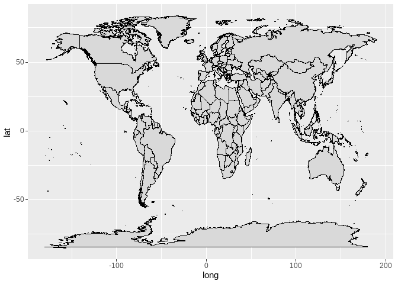

### 2.2.3. Take out Taiwan

``` r
ggplot(world.map, aes(x=long, y=lat, group=group))+
  geom_polygon(colour="black", fill='grey85')+
  coord_sf(xlim = c(118, 122.5), ylim = c(21.5, 26.5), crs = 4326)
```

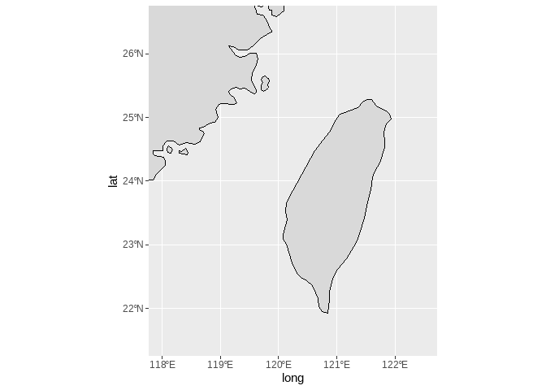
