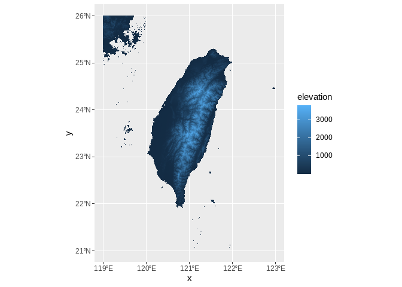
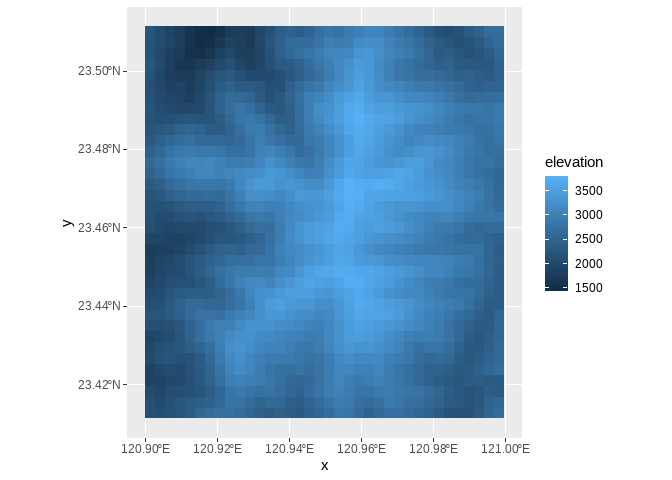
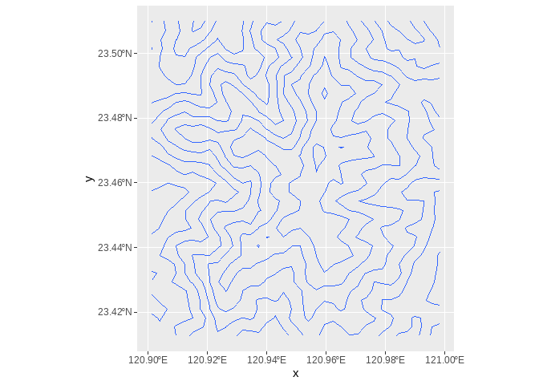
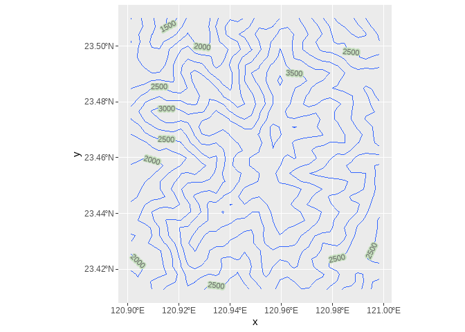
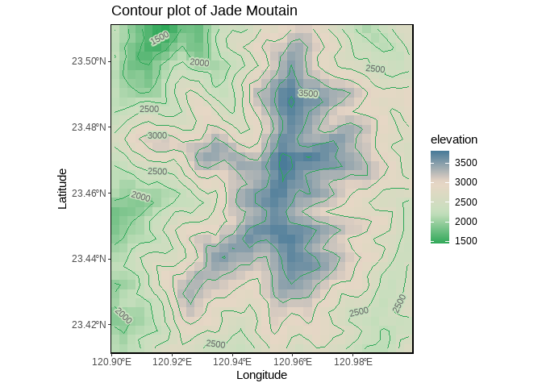
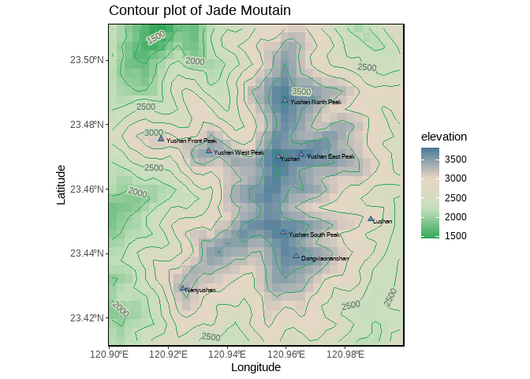

# **Class 13: Data Visualization, Coutour**

``` r
library(ggplot2)
library(dplyr)
library(sf)
library(ggpubr)
library(ggspatial) #annotation_north_arrow
library(raster)
library(metR) #install.packages("metR")
```

# 1. Using DEM data

## 1.1 Plotting whole Taiwan

### Loading the data of DEM data

You can download the DEM data at : <https://data.gov.tw/dataset/35430>

``` r
taiwan_DEM <- raster("E:/Drive/2_lab/Edu5_Course/R_MyFirstLesson/R/13_DataVisualize_Coutour/Attachment/TaiwanMapDEM/tif file/twdtm_asterV2_30m.tif" )
```

``` r
land <- aggregate(taiwan_DEM, fact=10)
Land_Eledt <- rasterToPoints(land)
Land_Eledt2 <- as.data.frame(Land_Eledt) %>%
  rename(elevation='Layer_1') 
```

### 3.3.2. Plotting the DEM of Taiwan

``` r
ggplot()+
  geom_tile(Land_Eledt2, mapping=aes(x=x, y=y, fill=elevation))+
  coord_sf(crs=4326)
```



#### Cut the region of Jade Moutain

``` r
Land_Eledt3 <- Land_Eledt2 %>%
  filter(x>120.9, x<121.0, 
         y>23.41, y<23.51)

ggplot()+
  geom_tile(Land_Eledt3, mapping=aes(x=x, y=y, fill=elevation))+
  coord_sf(crs=4326)
```



#### Draw the contour

``` r
ggplot()+
  geom_contour(Land_Eledt3, mapping=aes(x=x, y=y, z=elevation),binwidth =250)+
  coord_sf(crs=4326)
```



#### Add the elevation on the contour line

``` r
ggplot()+
  geom_contour(Land_Eledt3, mapping=aes(x=x, y=y, z=elevation), binwidth =250)+
  coord_sf(crs=4326)+
  geom_text_contour(data=Land_Eledt3 , mapping=aes(x=x, y=y, z=elevation), 
                    stroke = 0.2, size=3,
                    breaks = seq(0, 4000, by =250),
                    col="grey40", stroke.color="#C6E0BE")
```



### 3.3.3. Whole code of plotting Contour plot

``` r
mypal <- colorRampPalette(c("#2EA858","#C6E0BE","#EAD6C6","#497b99"))

JADE <- ggplot()+
  #raster of the plot
  geom_tile(Land_Eledt3, mapping=aes(x=x, y=y, fill=elevation))+
  
  #add a contour line
  geom_contour(Land_Eledt3, mapping=aes(x=x, y=y, z=elevation), 
               binwidth =250,color="#2EA858")+
  
  scale_fill_gradientn(colours = mypal(20))+
  geom_text_contour(data=Land_Eledt3 , mapping=aes(x=x, y=y, z=elevation), 
                    stroke = 0.2, size=3,
                    breaks = seq(0, 4000, by =250),
                    col="grey40", stroke.color="#C6E0BE")+
  scale_x_continuous(expand=c(0,0))+
  scale_y_continuous(expand=c(0,0))+
  
  coord_sf(crs=4326)+
  
  #labeling for the axis and tilte
  xlab("Longitude")+
  ylab("Latitude")+
  ggtitle("Contour plot of Jade Moutain")+
  
  #theme
  theme(panel.border = element_rect(colour = "black", fill=NA, linewidth =1.0),
        panel.background = element_rect(fill = "grey97", colour = "black"))


JADE 
```



# Exercise

Plot the mountain into the contour plot and add the name of the
mountain.


