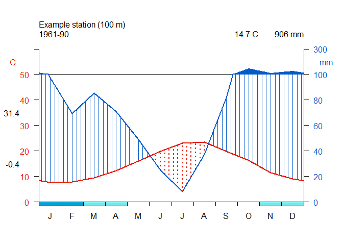
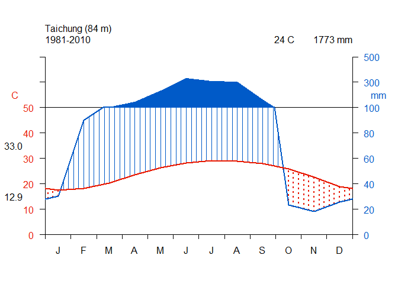
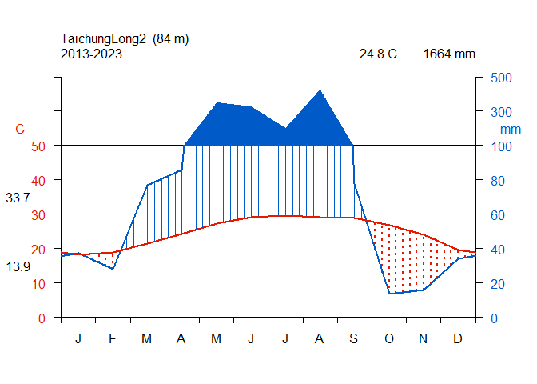

# **Class 14: Data Visualization, Climate Diagram**

# Class Instruction:

[**https://reurl.cc/GKAWrp**](https://reurl.cc/GKAWrp)

# 1. Climate Diagram

## 1.1. What is Climate Diagram

The ecological climatic diagram uses simple graphics to illustrate
variations in temperature, precipitation seasonality, and the duration
and amplitude of dry and wet seasons.

-   Through a standardized structure, it succinctly represents climate
    data.

-   It can be used to understand the relationship between terrestrial
    vegetation distribution and climate.

-   Development:

    -   In the year 1957, Bagouls and Gaussen created diagrams using a
        1:2 scale to depict monthly temperature and precipitation,
        enabling a quick understanding of the distribution of wet
        seasons.

    -   In 1960, Walter and Lieth made adjustments to the ecological
        climatic diagram by:

        -   Incorporating the duration of freezing periods.

        -   Shortening the vertical axis for precipitation, no longer
            maintaining a constant 1:2 ratio.

## 1.2. Draw the Climate Diagram

Look into the example data of climatol package

    ##          Jan  Feb  Mar  Apr  May  Jun  Jul  Aug  Sep   Oct   Nov   Dec
    ## Prec.   97.4 69.3 85.5 71.1 48.9 25.1  8.1 37.2 81.6 144.8 110.6 126.5
    ## Max.t.  15.4 16.1 17.2 19.7 23.9 27.9 31.3 31.4 26.5  22.9  18.2  15.8
    ## Min.t.  -0.1 -0.4  1.9  4.9  8.3 11.9 14.8 15.5 13.4   9.7   4.6   2.2
    ## Ab.m.t. -5.1 -7.0 -3.5 -1.7  3.4  8.2 11.6 12.2  9.0   3.0  -1.7  -3.6



## 1.2.1. Get the data from CWA website

link( <https://www.cwa.gov.tw/V8/C/index.html> )

    ##        X  Jan  Feb   Mar   Apr   May   Jun   Jul   Aug   Sep  Oct  Nov  Dec
    ## 1  Prec. 30.3 89.8 103.0 145.4 231.5 331.2 307.9 302.0 164.5 23.2 18.3 25.9
    ## 2  Max.t 22.0 22.4  24.6  27.6  30.2  31.9  33.0  32.6  31.8 30.1 27.0 23.6
    ## 3  Min.t 12.9 13.9  16.0  19.6  22.6  24.4  25.2  25.1  24.1 21.8 18.2 14.2
    ## 4 Ab.m.t 12.9 13.9  16.0  19.6  22.6  24.4  25.2  25.1  24.1 21.8 18.2 14.2



#### save the plot

``` r
png(file="Excercise_output/TaichungClimateDiagram.png",width =1600, height= 1800,res=300)
diagwl(Taichung1[,-1],col=NULL,stname="Taichung",alt=84,per="1981-2010",mlab="en", shem=FALSE)
dev.off()
```

    ## png 
    ##   2

## Exercise: Deal with the long data


