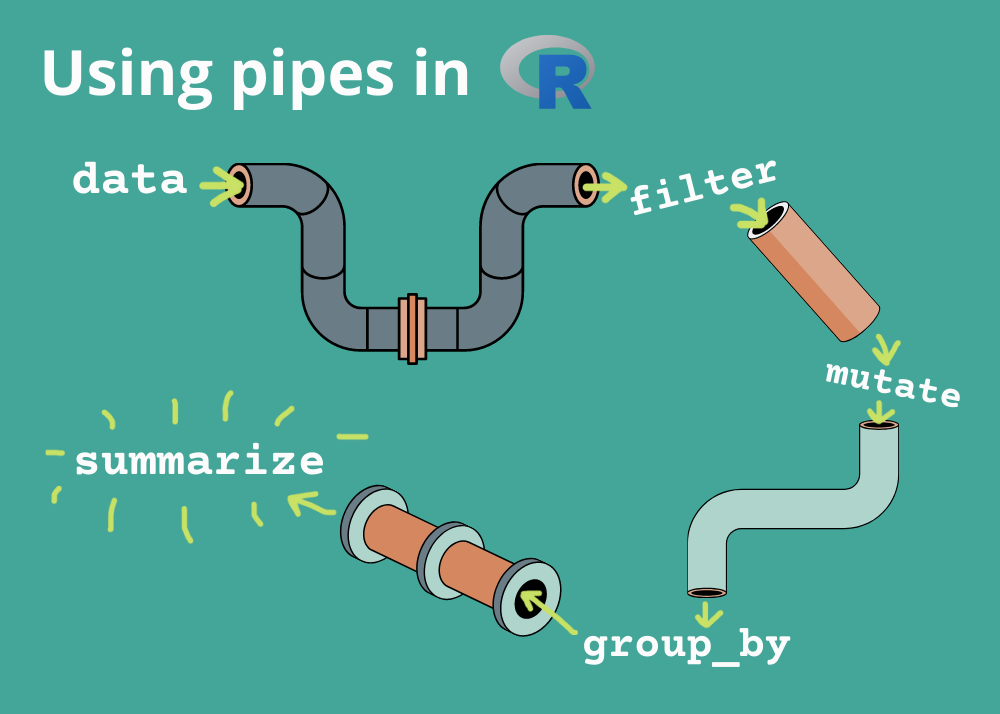

# **Class 6: Data Tidy, Grouping**

# Read the data first
```{r}
Taidt <- read.csv("E:/Drive/2_lab/Edu5_Course/R_MyFirstLesson/R/6_DataTidy_Grouping/Attachment/Taichung2013_2023.csv")

head(Taidt)
```


# 1. Using pipe %\>%

R pipes are a way to chain multiple operations together in a concise and expressive way. They are represented by the **%\>%** operator, which takes the output of the expression on its left and passes it as the first argument to the function on its right

**This is your data** %\>% **select( )** %\>% **filter( )** %\>% **Result**
 

In the following section, I will introduce some information about how to tidy your own data by R programming. Here, I will use **dplyr** package to tidy the data.

```{r message=FALSE, warning=FALSE}
library(dplyr) # install.package("dplyr")
```


```{r echo=T, tidy=TRUE,tidy.opts=list(width.cutoff=50)}
Taidt6 <- Taidt %>%
  select(station, Y, M, D, tavg, tmax, tmin, prec) %>%
  rename(precipitation="prec") %>%
  mutate(YMD=paste(Y, M, D, sep="_")) %>%
  filter(Y<=2017) %>%
  #mutate(YMD=paste(Y, M, D, sep="_")) %>%
  #mutate(station=as.character(station))
  ## Or you can type...
   mutate(YMD=paste(Y, M, D, sep="_"), 
          station=as.character(station), 
          x=D*78, 
          xx=x^0.5)
  #rename(precipitation="prec")
head(Taidt6)

```

### Do some simple plot

```{r out.width="80%"}
plot(Taidt6$tavg, Taidt6$precipitation)
hist(Taidt6$tavg)
boxplot(Taidt6$tavg~Taidt6$M)
```

# 2. Groupping data function

## 2.1. summarise()

using **summarise()** could calculate the value in high efficiency under **pipe** and **dplyr package**.

```{r message=FALSE, warning=FALSE}
Taidt7 <- Taidt6 %>%
  summarise(AveT=mean(tavg, na.rm=T), 
            AveTsd=sd(tavg, na.rm=T),
            Ave95=quantile(tavg, 0.95),
            Pre=sum(precipitation, na.rm=T))

head(Taidt7)
```

## 2.2. group_by()

By using **group_by**, you can aggregate the categories of your own variable and using **summarise()** to calculate the value of each variable.

Notice that **ungroup()** is always used after the **group()** command after performing calculations. If you forget to **ungroup()** data, future data management will likely produce errors. Always **ungroup()** when you've finished with your calculations.

```{r message=FALSE, warning=FALSE}
Taidt8 <- Taidt6 %>% 
  group_by(station, Y, M) %>%
  summarise(AveT=mean(tavg, na.rm=T), 
            AveTsd=sd(tavg, na.rm=T),
            Pre=sum(precipitation, na.rm=T)) %>%
  ungroup()
head(Taidt8, 10)

Taidt9 <- Taidt8 %>%
  group_by(station, Y) %>%
  summarise(averageT=mean(AveT, na.rm=T),
            maxT=max(AveT, na.rm = T),
            Precip=sum(Pre, na.rm=T)) %>%
  ungroup()
Taidt9

```

### Extra work of group_by()

```{r}
Taidt10 <- Taidt8 %>%
  group_by(station, Y) %>%
  mutate(AnualT=mean(AveT, na.rm=T), 
         AnualP=sum(Pre, na.rm=T)) %>%
  ungroup()

head(Taidt10, 10)
```

# Excercise

The following exercise is going to prepare for your next week data. Please use pipe to connect all your data.

1.  Input the data of **Taichung2013_2023.csv**.

2.  Please select "station", "Y", "M", "D", "tavg", "tmax", "tmin", and "prec" in Taichung 2013-2023 climate data.

3.  Please filter 2013-2017 data and **out put** to .csv file.

4.  Please filter 2017-2023 data and **out put** to .csv file.

Please email one rmd file to my email: [*jjakon11\@gmail.com*](mailto:jjakon11@gmail.com){.email}

Chen-Chia Ku

```{r eval=FALSE, include=FALSE}
Taidt <- read.csv("D:/Drive/2_lab/Edu5_Course/Rbasic/Course_Rbasic/Class5/Taichung2013_2023.csv")

HTaidt1 <- Taidt %>%
  select(station, Y, M, D, tavg, tmax, tmin, prec) %>%
  filter(Y<2017)

HTaidt2 <- Taidt %>%
  select(station, Y, M, D, tavg, tmax, tmin, prec) %>%
  filter(Y>2017)

write.csv(HTaidt1, "Taichung2013-2017.csv", row.names = F)
write.csv(HTaidt2, "Taichung2017-2023.csv", row.names = F)
```
