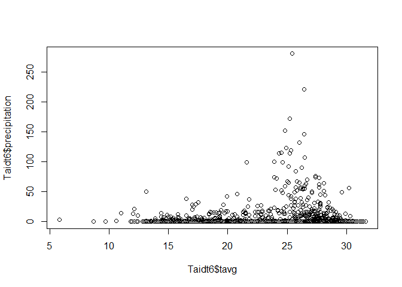
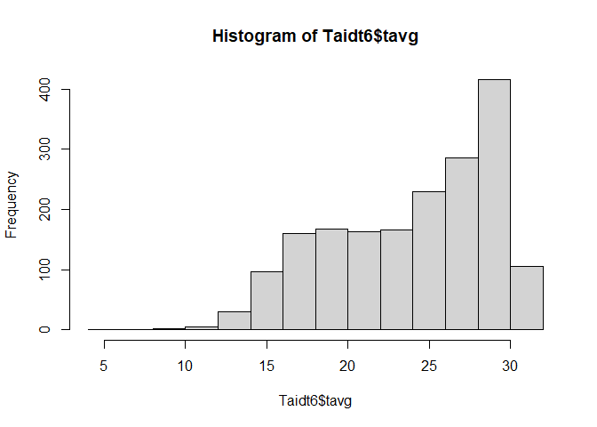
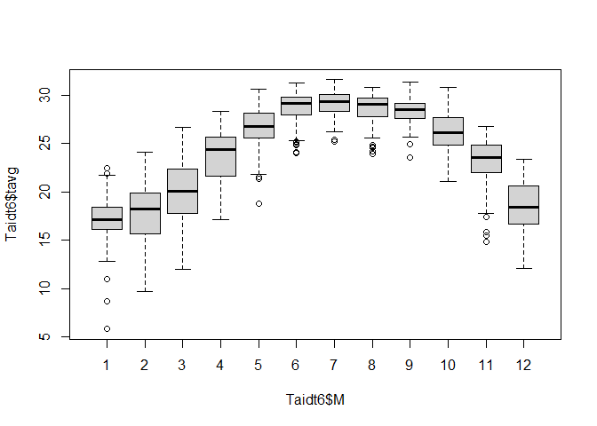

# **Class 6: Data Tidy, Grouping**

# Read the data first

``` r
Taidt <- read.csv("E:/Drive/2_lab/Edu5_Course/R_MyFirstLesson/R/6_DataTidy_Grouping/Attachment/Taichung2013_2023.csv")

head(Taidt)
```

    ##   X station      YMD    Y M D tavg tmax tmin AvgWS AvgWD MaxAvgWS MaxAvgWD
    ## 1 1  467490 20130101 2013 1 1 14.5 17.2 10.6   0.3   320      1.5      330
    ## 2 2  467490 20130102 2013 1 2 17.6 21.3 14.5   1.3   360      3.5      360
    ## 3 3  467490 20130103 2013 1 3 16.1 19.3 14.1   2.6   360      4.3       10
    ## 4 4  467490 20130104 2013 1 4 16.6 21.6 13.8   1.6   360      3.8      360
    ## 5 5  467490 20130105 2013 1 5 17.6 22.1 15.3   2.2   350      4.4      360
    ## 6 6  467490 20130106 2013 1 6 18.1 23.2 14.3   1.8   350      4.1      340
    ##   MaxGutWS MaxGutWD prec
    ## 1      3.8      330  0.0
    ## 2      7.9       10  0.4
    ## 3      9.7      330  3.6
    ## 4      7.1       10  0.0
    ## 5      9.7      360  0.0
    ## 6      9.2      310  0.0

# 1. Using pipe %\>%

R pipes are a way to chain multiple operations together in a concise and
expressive way. They are represented by the **%\>%** operator, which
takes the output of the expression on its left and passes it as the
first argument to the function on its right

**This is your data** %\>% **select( )** %\>% **filter( )** %\>%
**Result** 

In the following section, I will introduce some information about how to
tidy your own data by R programming. Here, I will use **dplyr** package
to tidy the data.

``` r
library(dplyr) # install.package("dplyr")
```

``` r
Taidt6 <- Taidt %>%
    select(station, Y, M, D, tavg, tmax, tmin, prec) %>%
    rename(precipitation = "prec") %>%
    mutate(YMD = paste(Y, M, D, sep = "_")) %>%
    filter(Y <= 2017) %>%
    # mutate(YMD=paste(Y, M, D, sep='_')) %>%
    # mutate(station=as.character(station)) Or
    # you can type...
mutate(YMD = paste(Y, M, D, sep = "_"), station = as.character(station),
    x = D * 78, xx = x^0.5)
# rename(precipitation='prec')
head(Taidt6)
```

    ##   station    Y M D tavg tmax tmin precipitation      YMD   x        xx
    ## 1  467490 2013 1 1 14.5 17.2 10.6           0.0 2013_1_1  78  8.831761
    ## 2  467490 2013 1 2 17.6 21.3 14.5           0.4 2013_1_2 156 12.489996
    ## 3  467490 2013 1 3 16.1 19.3 14.1           3.6 2013_1_3 234 15.297059
    ## 4  467490 2013 1 4 16.6 21.6 13.8           0.0 2013_1_4 312 17.663522
    ## 5  467490 2013 1 5 17.6 22.1 15.3           0.0 2013_1_5 390 19.748418
    ## 6  467490 2013 1 6 18.1 23.2 14.3           0.0 2013_1_6 468 21.633308

### Do some simple plot

``` r
plot(Taidt6$tavg, Taidt6$precipitation)
```



``` r
hist(Taidt6$tavg)
```



``` r
boxplot(Taidt6$tavg~Taidt6$M)
```



# 2. Groupping data function

## 2.1. summarise()

using **summarise()** could calculate the value in high efficiency under
**pipe** and **dplyr package**.

``` r
Taidt7 <- Taidt6 %>%
  summarise(AveT=mean(tavg, na.rm=T), 
            AveTsd=sd(tavg, na.rm=T),
            Ave95=quantile(tavg, 0.95),
            Pre=sum(precipitation, na.rm=T))

head(Taidt7)
```

    ##       AveT   AveTsd Ave95    Pre
    ## 1 24.05345 4.920805  30.2 8299.9

## 2.2. group_by()

By using **group_by**, you can aggregate the categories of your own
variable and using **summarise()** to calculate the value of each
variable.

Notice that **ungroup()** is always used after the **group()** command
after performing calculations. If you forget to **ungroup()** data,
future data management will likely produce errors. Always **ungroup()**
when you’ve finished with your calculations.

``` r
Taidt8 <- Taidt6 %>% 
  group_by(station, Y, M) %>%
  summarise(AveT=mean(tavg, na.rm=T), 
            AveTsd=sd(tavg, na.rm=T),
            Pre=sum(precipitation, na.rm=T)) %>%
  ungroup()
head(Taidt8, 10)
```

    ## # A tibble: 10 × 6
    ##    station     Y     M  AveT AveTsd   Pre
    ##    <chr>   <int> <int> <dbl>  <dbl> <dbl>
    ##  1 467490   2013     1  16.9  1.44   11.2
    ##  2 467490   2013     2  19.4  1.96    1.2
    ##  3 467490   2013     3  21.0  2.65   62.7
    ##  4 467490   2013     4  22.2  2.50  259. 
    ##  5 467490   2013     5  26.4  2.18  356. 
    ##  6 467490   2013     6  28.8  0.989  72.6
    ##  7 467490   2013     7  28.1  1.04  468. 
    ##  8 467490   2013     8  28.2  1.80  763  
    ##  9 467490   2013     9  27.8  1.26   44.9
    ## 10 467490   2013    10  24.9  2.18    2.7

``` r
Taidt9 <- Taidt8 %>%
  group_by(station, Y) %>%
  summarise(averageT=mean(AveT, na.rm=T),
            maxT=max(AveT, na.rm = T),
            Precip=sum(Pre, na.rm=T)) %>%
  ungroup()
Taidt9
```

    ## # A tibble: 5 × 5
    ##   station     Y averageT  maxT Precip
    ##   <chr>   <int>    <dbl> <dbl>  <dbl>
    ## 1 467490   2013     23.6  28.8  2133 
    ## 2 467490   2014     23.8  30.1  1466.
    ## 3 467490   2015     24.3  29.7  1526.
    ## 4 467490   2016     24.2  29.4  1522.
    ## 5 467490   2017     24.2  29.4  1652.

### Extra work of group_by()

``` r
Taidt10 <- Taidt8 %>%
  group_by(station, Y) %>%
  mutate(AnualT=mean(AveT, na.rm=T), 
         AnualP=sum(Pre, na.rm=T)) %>%
  ungroup()

head(Taidt10, 10)
```

    ## # A tibble: 10 × 8
    ##    station     Y     M  AveT AveTsd   Pre AnualT AnualP
    ##    <chr>   <int> <int> <dbl>  <dbl> <dbl>  <dbl>  <dbl>
    ##  1 467490   2013     1  16.9  1.44   11.2   23.6   2133
    ##  2 467490   2013     2  19.4  1.96    1.2   23.6   2133
    ##  3 467490   2013     3  21.0  2.65   62.7   23.6   2133
    ##  4 467490   2013     4  22.2  2.50  259.    23.6   2133
    ##  5 467490   2013     5  26.4  2.18  356.    23.6   2133
    ##  6 467490   2013     6  28.8  0.989  72.6   23.6   2133
    ##  7 467490   2013     7  28.1  1.04  468.    23.6   2133
    ##  8 467490   2013     8  28.2  1.80  763     23.6   2133
    ##  9 467490   2013     9  27.8  1.26   44.9   23.6   2133
    ## 10 467490   2013    10  24.9  2.18    2.7   23.6   2133

# Excercise

The following exercise is going to prepare for your next week data.
Please use pipe to connect all your data.

1.  Input the data of **Taichung2013_2023.csv**.

2.  Please select “station”, “Y”, “M”, “D”, “tavg”, “tmax”, “tmin”, and
    “prec” in Taichung 2013-2023 climate data.

3.  Please filter 2013-2017 data and **out put** to .csv file.

4.  Please filter 2017-2023 data and **out put** to .csv file.

Please email one rmd file to my email:
<a href="mailto:jjakon11@gmail.com"
class="email"><em>jjakon11@gmail.com</em></a>

Chen-Chia Ku
