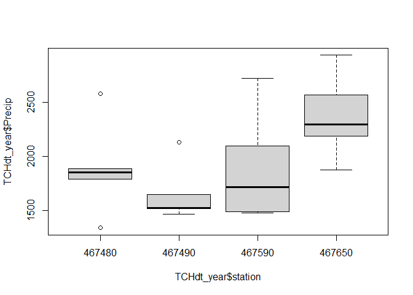
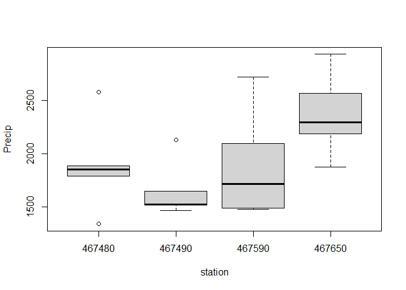
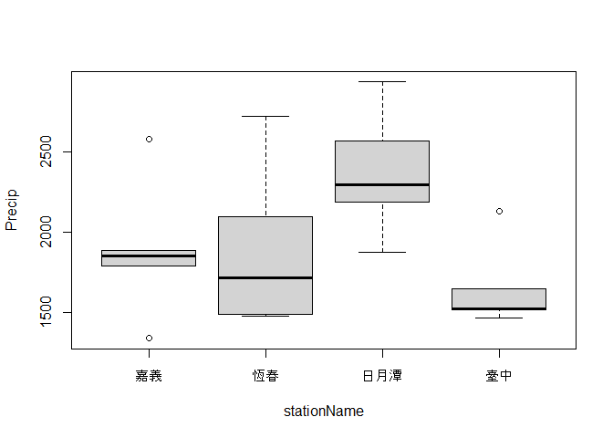

# **Class 7: Data Tidy, Bind Multiple Data**

# 1. Review from Class 6

``` r
library(dplyr) # install.package("dplyr")
```

``` r
Taidt <- read.csv("E:/Drive/2_lab/Edu5_Course/R_MyFirstLesson/R/7_DataTidy_BindMultipleData/Attachment/Taichung2013_2023.csv")

Taidt6 <- Taidt %>%
  select(station, Y, M, D, tavg, tmax, tmin, prec) %>%
  rename(precipitation="prec") %>%
  mutate(YMD=paste(Y, M, D, sep="_")) %>%
  filter(Y<=2017) %>%
  #mutate(YMD=paste(Y, M, D, sep="_")) %>%
  #mutate(station=as.character(station))
  ## Or you can type...
   mutate(YMD=paste(Y, M, D, sep="_"), 
          station=as.character(station))
  #rename(precipitation="prec")
head(Taidt6)
```

    ##   station    Y M D tavg tmax tmin precipitation      YMD
    ## 1  467490 2013 1 1 14.5 17.2 10.6           0.0 2013_1_1
    ## 2  467490 2013 1 2 17.6 21.3 14.5           0.4 2013_1_2
    ## 3  467490 2013 1 3 16.1 19.3 14.1           3.6 2013_1_3
    ## 4  467490 2013 1 4 16.6 21.6 13.8           0.0 2013_1_4
    ## 5  467490 2013 1 5 17.6 22.1 15.3           0.0 2013_1_5
    ## 6  467490 2013 1 6 18.1 23.2 14.3           0.0 2013_1_6

``` r
Taidt8 <- Taidt6 %>% 
  group_by(station, Y, M) %>%
  summarise(AveT=mean(tavg, na.rm=T), 
            AveTsd=sd(tavg, na.rm=T),
            Pre=sum(precipitation, na.rm=T)) %>%
  ungroup()
head(Taidt8, 10)
```

    ## # A tibble: 10 × 6
    ##    station     Y     M  AveT AveTsd   Pre
    ##    <chr>   <int> <int> <dbl>  <dbl> <dbl>
    ##  1 467490   2013     1  16.9  1.44   11.2
    ##  2 467490   2013     2  19.4  1.96    1.2
    ##  3 467490   2013     3  21.0  2.65   62.7
    ##  4 467490   2013     4  22.2  2.50  259. 
    ##  5 467490   2013     5  26.4  2.18  356. 
    ##  6 467490   2013     6  28.8  0.989  72.6
    ##  7 467490   2013     7  28.1  1.04  468. 
    ##  8 467490   2013     8  28.2  1.80  763  
    ##  9 467490   2013     9  27.8  1.26   44.9
    ## 10 467490   2013    10  24.9  2.18    2.7

``` r
Taidt9 <- Taidt8 %>%
  group_by(station, Y) %>%
  summarise(averageT=mean(AveT, na.rm=T),
            maxT=max(AveT, na.rm = T),
            Precip=sum(Pre, na.rm=T)) %>%
  ungroup()
Taidt9
```

    ## # A tibble: 5 × 5
    ##   station     Y averageT  maxT Precip
    ##   <chr>   <int>    <dbl> <dbl>  <dbl>
    ## 1 467490   2013     23.6  28.8  2133 
    ## 2 467490   2014     23.8  30.1  1466.
    ## 3 467490   2015     24.3  29.7  1526.
    ## 4 467490   2016     24.2  29.4  1522.
    ## 5 467490   2017     24.2  29.4  1652.

# 2. Read other data set

``` r
Chiadt <- read.csv("E:/Drive/2_lab/Edu5_Course/R_MyFirstLesson/R/7_DataTidy_BindMultipleData/Attachment/Chiayi2013_2023.csv")
Hendt <- read.csv("E:/Drive/2_lab/Edu5_Course/R_MyFirstLesson/R/7_DataTidy_BindMultipleData/Attachment/Henchun2013_2023.csv")
SunMoondt <- read.csv("E:/Drive/2_lab/Edu5_Course/R_MyFirstLesson/R/7_DataTidy_BindMultipleData/Attachment/SunMoondt2013_2023.csv")
```

``` r
head(Chiadt)
```

    ##   station      YMD    Y M D tavg tmax tmin AvgWS AvgWD MaxAvgWS MaxAvgWD
    ## 1  467480 20130101 2013 1 1 14.1 19.5  9.2   1.8    10      4.1       10
    ## 2  467480 20130102 2013 1 2 17.6 22.5 12.5   2.8    10      5.5       10
    ## 3  467480 20130103 2013 1 3 16.1 18.0 14.0   3.2    10      5.7      360
    ## 4  467480 20130104 2013 1 4 16.3 20.9 13.5   2.9   360      4.6      350
    ## 5  467480 20130105 2013 1 5 17.4 22.9 14.5   3.2    10      5.8      360
    ## 6  467480 20130106 2013 1 6 18.2 24.5 14.7   3.1   360      5.1      360
    ##   MaxGutWS MaxGutWD prec
    ## 1      7.3       10  0.0
    ## 2      9.5      360   NA
    ## 3      9.5       10  2.5
    ## 4      8.4      360  0.0
    ## 5      9.9      360  0.0
    ## 6      9.1      360  0.0

``` r
head(Hendt)
```

    ##   station      YMD    Y M D tavg tmax tmin AvgWS AvgWD MaxAvgWS MaxAvgWD
    ## 1  467590 20130101 2013 1 1 20.3 23.0 17.5   3.5    10      7.1       20
    ## 2  467590 20130102 2013 1 2 22.7 25.1 20.5   3.3    30      6.0       20
    ## 3  467590 20130103 2013 1 3 22.0 24.3 19.7   8.3    30     13.8       30
    ## 4  467590 20130104 2013 1 4 21.6 23.3 19.8   6.5    30     11.2       40
    ## 5  467590 20130105 2013 1 5 23.1 26.8 20.5   3.6    30      8.5       40
    ## 6  467590 20130106 2013 1 6 23.8 26.7 20.5   3.6    30      5.8       40
    ##   MaxGutWS MaxGutWD prec
    ## 1     13.5       10    0
    ## 2     12.3       80    0
    ## 3     29.5       20    0
    ## 4     24.3       30    0
    ## 5     16.8       50    0
    ## 6     12.1       20    0

``` r
head(SunMoondt)
```

    ##   station      YMD    Y M D tavg tmax tmin AvgWS AvgWD MaxAvgWS MaxAvgWD
    ## 1  467650 20130101 2013 1 1 10.9 14.4  7.6   0.7    10      2.5       90
    ## 2  467650 20130102 2013 1 2 14.6 19.1 11.8   0.9    70      2.8       20
    ## 3  467650 20130103 2013 1 3 15.0 20.4 13.2   0.7    80      2.8      200
    ## 4  467650 20130104 2013 1 4 14.4 19.4 12.1   0.6   100      2.3      250
    ## 5  467650 20130105 2013 1 5 15.8 21.4 12.2   0.5    90      2.0      130
    ## 6  467650 20130106 2013 1 6 16.4 22.2 12.7   0.7   330      3.0      150
    ##   MaxGutWS MaxGutWD prec
    ## 1      4.5       80    0
    ## 2      8.8      100    0
    ## 3      5.6      250    2
    ## 4      4.3      170    0
    ## 5      4.0      360    0
    ## 6      7.7      100    0

# 3. Combine several dataset.

## 3.1. bind_rows()

**bind_rows()** can bind all of the data together into the next row by
the same column names.

``` r
TCHdt <- bind_rows(Taidt, Chiadt, Hendt, SunMoondt) 


TCHdtx <- Taidt %>%
  bind_rows(Chiadt, Hendt, SunMoondt)
```

So now, after binding the data together, we can compile those data and
calculate the climate data under different climate station.

``` r
TCHdt1 <- bind_rows(Taidt, Chiadt, Hendt, SunMoondt) %>%
  select(station, Y, M, D, tavg, tmax, tmin, prec) %>%
  rename(precipitation="prec") %>%
  mutate(YMD=paste(Y, M, D, sep="_")) %>%
  filter(Y<=2017) %>%
  #mutate(YMD=paste(Y, M, D, sep="_")) %>%
  #mutate(station=as.character(station))
  ## Or you can type...
   mutate(YMD=paste(Y, M, D, sep="_"), 
          station=as.character(station))
head(TCHdt1)
```

    ##   station    Y M D tavg tmax tmin precipitation      YMD
    ## 1  467490 2013 1 1 14.5 17.2 10.6           0.0 2013_1_1
    ## 2  467490 2013 1 2 17.6 21.3 14.5           0.4 2013_1_2
    ## 3  467490 2013 1 3 16.1 19.3 14.1           3.6 2013_1_3
    ## 4  467490 2013 1 4 16.6 21.6 13.8           0.0 2013_1_4
    ## 5  467490 2013 1 5 17.6 22.1 15.3           0.0 2013_1_5
    ## 6  467490 2013 1 6 18.1 23.2 14.3           0.0 2013_1_6

``` r
TCHdt_month <- TCHdt1 %>% 
  group_by(station, Y, M) %>%
  summarise(AveT=mean(tavg, na.rm=T), 
            AveTsd=sd(tavg, na.rm=T),
            Pre=sum(precipitation, na.rm=T)) %>%
  ungroup()
head(TCHdt_month, 10)
```

    ## # A tibble: 10 × 6
    ##    station     Y     M  AveT AveTsd    Pre
    ##    <chr>   <int> <int> <dbl>  <dbl>  <dbl>
    ##  1 467480   2013     1  16.7  1.48    15.1
    ##  2 467480   2013     2  19.4  1.95     3.5
    ##  3 467480   2013     3  21.0  2.79    42.4
    ##  4 467480   2013     4  22.5  2.46   161. 
    ##  5 467480   2013     5  26.6  1.98   377. 
    ##  6 467480   2013     6  28.8  1.00    81.7
    ##  7 467480   2013     7  28.4  0.731  337. 
    ##  8 467480   2013     8  28.0  1.39  1367. 
    ##  9 467480   2013     9  27.5  1.15   135. 
    ## 10 467480   2013    10  24.2  2.31     4.5

``` r
TCHdt_year <- TCHdt_month %>% 
  group_by(station, Y) %>%
  summarise(averageT=mean(AveT, na.rm=T),
            maxT=max(AveT, na.rm = T),
            Precip=sum(Pre, na.rm=T)) %>%
  ungroup()
head(TCHdt_year, 10)
```

    ## # A tibble: 10 × 5
    ##    station     Y averageT  maxT Precip
    ##    <chr>   <int>    <dbl> <dbl>  <dbl>
    ##  1 467480   2013     23.4  28.8  2580.
    ##  2 467480   2014     23.6  30.1  1342.
    ##  3 467480   2015     24.3  30.1  1790.
    ##  4 467480   2016     24.3  29.5  1886.
    ##  5 467480   2017     24.5  29.8  1855.
    ##  6 467490   2013     23.6  28.8  2133 
    ##  7 467490   2014     23.8  30.1  1466.
    ##  8 467490   2015     24.3  29.7  1526.
    ##  9 467490   2016     24.2  29.4  1522.
    ## 10 467490   2017     24.2  29.4  1652.

``` r
boxplot(TCHdt_year$Precip~TCHdt_year$station)
```



``` r
boxplot(Precip~station, data=TCHdt_year)
```



## 3.2. bind_cols()

Number of rows for each data should be the same.

``` r
stationName <- read.csv("E:/Drive/2_lab/Edu5_Course/R_MyFirstLesson/R/7_DataTidy_BindMultipleData/Attachment/StationName.csv", fileEncoding = "big5")

head(stationName)
```

    ##   station stationName     Z     wgsX    wgsY     TM2X    TM2Y
    ## 1  466880        板橋   9.7 121.4420 24.9976 294616.6 2765584
    ## 2  466900        淡水  19.0 121.4489 25.1649 295251.6 2784118
    ## 3  466910        鞍部 825.8 121.5297 25.1826 303389.1 2786108
    ## 4  466920        臺北   6.3 121.5149 25.0377 301958.6 2770052
    ## 5  466930      竹子湖 607.1 121.5445 25.1621 304890.0 2783843
    ## 6  466940        基隆  26.7 121.7405 25.1333 324666.6 2780747

``` r
CBind <- bind_cols(Taidt, Chiadt, Hendt, SunMoondt)
head(CBind)
```

    ##   station...1  YMD...2 Y...3 M...4 D...5 tavg...6 tmax...7 tmin...8 AvgWS...9
    ## 1      467490 20130101  2013     1     1     14.5     17.2     10.6       0.3
    ## 2      467490 20130102  2013     1     2     17.6     21.3     14.5       1.3
    ## 3      467490 20130103  2013     1     3     16.1     19.3     14.1       2.6
    ## 4      467490 20130104  2013     1     4     16.6     21.6     13.8       1.6
    ## 5      467490 20130105  2013     1     5     17.6     22.1     15.3       2.2
    ## 6      467490 20130106  2013     1     6     18.1     23.2     14.3       1.8
    ##   AvgWD...10 MaxAvgWS...11 MaxAvgWD...12 MaxGutWS...13 MaxGutWD...14 prec...15
    ## 1        320           1.5           330           3.8           330       0.0
    ## 2        360           3.5           360           7.9            10       0.4
    ## 3        360           4.3            10           9.7           330       3.6
    ## 4        360           3.8           360           7.1            10       0.0
    ## 5        350           4.4           360           9.7           360       0.0
    ## 6        350           4.1           340           9.2           310       0.0
    ##   station...16 YMD...17 Y...18 M...19 D...20 tavg...21 tmax...22 tmin...23
    ## 1       467480 20130101   2013      1      1      14.1      19.5       9.2
    ## 2       467480 20130102   2013      1      2      17.6      22.5      12.5
    ## 3       467480 20130103   2013      1      3      16.1      18.0      14.0
    ## 4       467480 20130104   2013      1      4      16.3      20.9      13.5
    ## 5       467480 20130105   2013      1      5      17.4      22.9      14.5
    ## 6       467480 20130106   2013      1      6      18.2      24.5      14.7
    ##   AvgWS...24 AvgWD...25 MaxAvgWS...26 MaxAvgWD...27 MaxGutWS...28 MaxGutWD...29
    ## 1        1.8         10           4.1            10           7.3            10
    ## 2        2.8         10           5.5            10           9.5           360
    ## 3        3.2         10           5.7           360           9.5            10
    ## 4        2.9        360           4.6           350           8.4           360
    ## 5        3.2         10           5.8           360           9.9           360
    ## 6        3.1        360           5.1           360           9.1           360
    ##   prec...30 station...31 YMD...32 Y...33 M...34 D...35 tavg...36 tmax...37
    ## 1       0.0       467590 20130101   2013      1      1      20.3      23.0
    ## 2        NA       467590 20130102   2013      1      2      22.7      25.1
    ## 3       2.5       467590 20130103   2013      1      3      22.0      24.3
    ## 4       0.0       467590 20130104   2013      1      4      21.6      23.3
    ## 5       0.0       467590 20130105   2013      1      5      23.1      26.8
    ## 6       0.0       467590 20130106   2013      1      6      23.8      26.7
    ##   tmin...38 AvgWS...39 AvgWD...40 MaxAvgWS...41 MaxAvgWD...42 MaxGutWS...43
    ## 1      17.5        3.5         10           7.1            20          13.5
    ## 2      20.5        3.3         30           6.0            20          12.3
    ## 3      19.7        8.3         30          13.8            30          29.5
    ## 4      19.8        6.5         30          11.2            40          24.3
    ## 5      20.5        3.6         30           8.5            40          16.8
    ## 6      20.5        3.6         30           5.8            40          12.1
    ##   MaxGutWD...44 prec...45 station...46 YMD...47 Y...48 M...49 D...50 tavg...51
    ## 1            10         0       467650 20130101   2013      1      1      10.9
    ## 2            80         0       467650 20130102   2013      1      2      14.6
    ## 3            20         0       467650 20130103   2013      1      3      15.0
    ## 4            30         0       467650 20130104   2013      1      4      14.4
    ## 5            50         0       467650 20130105   2013      1      5      15.8
    ## 6            20         0       467650 20130106   2013      1      6      16.4
    ##   tmax...52 tmin...53 AvgWS...54 AvgWD...55 MaxAvgWS...56 MaxAvgWD...57
    ## 1      14.4       7.6        0.7         10           2.5            90
    ## 2      19.1      11.8        0.9         70           2.8            20
    ## 3      20.4      13.2        0.7         80           2.8           200
    ## 4      19.4      12.1        0.6        100           2.3           250
    ## 5      21.4      12.2        0.5         90           2.0           130
    ## 6      22.2      12.7        0.7        330           3.0           150
    ##   MaxGutWS...58 MaxGutWD...59 prec...60
    ## 1           4.5            80         0
    ## 2           8.8           100         0
    ## 3           5.6           250         2
    ## 4           4.3           170         0
    ## 5           4.0           360         0
    ## 6           7.7           100         0

Try this code. Can you combine those data? And why?

``` r
CBind1 <- bind_cols(Taidt, Chiadt, Hendt, SunMoondt, stationName)
```

## 3.3. left_join()

Mutating joins add columns from y to x, matching observations based on
the keys.

Change the data type of “station”.

``` r
TCHdt_year1 <- TCHdt_year %>% 
  mutate(station=as.numeric(station)) %>%
  left_join(stationName, by=c("station"="station"))
```

Different function in **left_join()** to do the same result

``` r
TCHdt_year1 <- TCHdt_year %>% 
  mutate(station=as.numeric(station)) %>%
  left_join(stationName, by=join_by(station==station))

TCHdt_year1 <- TCHdt_year %>% 
  mutate(station=as.numeric(station)) %>%
  left_join(stationName, by=join_by(station))
```

Try **right_join()** and **full_join()**

``` r
TCHdt_test1 <- TCHdt_year %>% 
  mutate(station=as.numeric(station)) %>%
  right_join(stationName, by=c("station"="station"))

TCHdt_test2 <- TCHdt_year %>% 
  mutate(station=as.numeric(station)) %>%
  full_join(stationName, by=c("station"="station"))
```

Plot the data for each station name

``` r
boxplot(Precip~stationName, data=TCHdt_year1)
```



# 4. Do some statistic

Compare whether there are any difference in precipitation among
different station?

``` r
ANO <- aov(Precip~stationName, data=TCHdt_year1)
summary(ANO)
```

    ##             Df  Sum Sq Mean Sq F value Pr(>F)  
    ## stationName  3 1342886  447629   2.541  0.093 .
    ## Residuals   16 2818841  176178                 
    ## ---
    ## Signif. codes:  0 '***' 0.001 '**' 0.01 '*' 0.05 '.' 0.1 ' ' 1

# 5. Excercise

Combine climate data from multiple climate stations, then use the
**boxplot()** function to plot the average temperature, precipitation,
maximum temperature, and minimum temperature. Afterward, test whether
there are any significant differences in each variable at different
elevations.

Please submit write the code and save it into .rmd file. And email one
.rmd file to my email: <a href="mailto:jjakon11@gmail.com"
class="email"><em>jjakon11@gmail.com</em></a>

Chen-Chia Ku

``` r
Excerdt <- read.csv("E:/Drive/2_lab/Edu5_Course/R_MyFirstLesson/R/7_DataTidy_BindMultipleData/Attachment/Excercise.csv")
stationName <- read.csv("E:/Drive/2_lab/Edu5_Course/R_MyFirstLesson/R/7_DataTidy_BindMultipleData/Attachment/StationName.csv", fileEncoding = "big5")
library(tidyr)

Excerdt1 <- Excerdt%>%
  select(station, Y, M, D, tavg, tmax, tmin, prec) %>%
  rename(precipitation="prec") %>%
  mutate(YMD=paste(Y, M, D, sep="_")) %>%
  filter(Y<=2017) %>%
  mutate(YMD=paste(Y, M, D, sep="_"), 
        station=as.character(station)) %>%
  
  #Monthly data
  group_by(station, Y, M) %>%
  summarise(AveT=mean(tavg, na.rm=T), 
            AveTsd=sd(tavg, na.rm=T),
            Pre=sum(precipitation, na.rm=T)) %>%
  ungroup() %>% 
  
  #Annual data
  group_by(station, Y) %>%
  summarise(averageT=mean(AveT, na.rm=T),
            maxT=max(AveT, na.rm = T),
            Precip=sum(Pre, na.rm=T)) %>%
  ungroup() %>%
  
  #left join the station name into the data
  mutate(station=as.numeric(station)) %>%
  left_join(stationName, by=c("station"="station"))
```

    ## `summarise()` has grouped output by 'station', 'Y'. You can override using the
    ## `.groups` argument.
    ## `summarise()` has grouped output by 'station'. You can override using the
    ## `.groups` argument.

``` r
Excerdt2 <- Excerdt1 %>%
  gather("Variable", "value", averageT:Precip ) %>%
  arrange(station, Variable, Y) %>%
  group_by(Variable, station) %>%
  mutate(Diff=value-lag(value)) %>%
  ungroup()  


Excerdt3 <- Excerdt2 %>%
  gather("Variable2", "value2", value:Diff) %>%
  mutate(Variable3=paste(Variable, Variable2,sep="_" )) %>%
  dplyr::select(-Variable, -Variable2) %>%
  spread(Variable3, value2)
```
