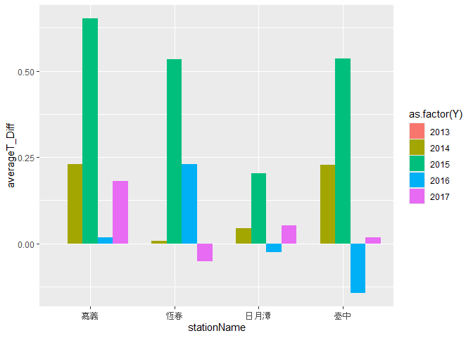

# **Class 8: Data Tidy, Fat & Thin Data**

# 1. Review from Class 7

We introduce the information about binding row, columns and also join
the other data set within the same variable.

``` r
library(dplyr)
```

## Input the data

``` r
Taidt <- read.csv("E:/Drive/2_lab/Edu5_Course/R_MyFirstLesson/R/8_DataTidy_Fat&ThinData/Attachment/Taichung2013_2023.csv")
Chiadt <- read.csv("E:/Drive/2_lab/Edu5_Course/R_MyFirstLesson/R/8_DataTidy_Fat&ThinData/Attachment/Chiayi2013_2023.csv")
Hendt <- read.csv("E:/Drive/2_lab/Edu5_Course/R_MyFirstLesson/R/8_DataTidy_Fat&ThinData/Attachment/Henchun2013_2023.csv")
SunMoondt <- read.csv("E:/Drive/2_lab/Edu5_Course/R_MyFirstLesson/R/8_DataTidy_Fat&ThinData/Attachment/SunMoondt2013_2023.csv")
stationName <- read.csv("E:/Drive/2_lab/Edu5_Course/R_MyFirstLesson/R/8_DataTidy_Fat&ThinData/Attachment/StationName.csv", fileEncoding = "big5")
```

## Data compiling

``` r
TCHdt_year1 <- bind_rows(Taidt, Chiadt, Hendt, SunMoondt) %>%
  select(station, Y, M, D, tavg, tmax, tmin, prec) %>%
  rename(precipitation="prec") %>%
  mutate(YMD=paste(Y, M, D, sep="_")) %>%
  filter(Y<=2017) %>%
  mutate(YMD=paste(Y, M, D, sep="_"), 
        station=as.character(station)) %>%
  
  #Monthly data
  group_by(station, Y, M) %>%
  summarise(AveT=mean(tavg, na.rm=T), 
            AveTsd=sd(tavg, na.rm=T),
            Pre=sum(precipitation, na.rm=T)) %>%
  ungroup() %>% 
  
  #Annual data
  group_by(station, Y) %>%
  summarise(averageT=mean(AveT, na.rm=T),
            maxT=max(AveT, na.rm = T),
            Precip=sum(Pre, na.rm=T)) %>%
  ungroup() %>%
  
  #left join the station name into the data
  mutate(station=as.numeric(station)) %>%
  left_join(stationName, by=c("station"="station"))
```

    ## `summarise()` has grouped output by 'station', 'Y'. You can override using the
    ## `.groups` argument.
    ## `summarise()` has grouped output by 'station'. You can override using the
    ## `.groups` argument.

``` r
head(TCHdt_year1)
```

    ## # A tibble: 6 × 11
    ##   station     Y averageT  maxT Precip stationName     Z  wgsX  wgsY    TM2X
    ##     <dbl> <int>    <dbl> <dbl>  <dbl> <chr>       <dbl> <dbl> <dbl>   <dbl>
    ## 1  467480  2013     23.4  28.8  2580. 嘉義         26.9  120.  23.5 192079.
    ## 2  467480  2014     23.6  30.1  1342. 嘉義         26.9  120.  23.5 192079.
    ## 3  467480  2015     24.3  30.1  1790. 嘉義         26.9  120.  23.5 192079.
    ## 4  467480  2016     24.3  29.5  1886. 嘉義         26.9  120.  23.5 192079.
    ## 5  467480  2017     24.5  29.8  1855. 嘉義         26.9  120.  23.5 192079.
    ## 6  467490  2013     23.6  28.8  2133  臺中         84    121.  24.1 217896.
    ## # ℹ 1 more variable: TM2Y <dbl>

# 2. Long data and wide data

**Wide data**, each individual variable occupies their own row, and each
of their variables occupy a single column. As such, an easy way to
identify wide data is that the data in the first column tend not to
repeat.

**Long data** allows for multiple rows for each variable, and instead
records new attributes or observations as a new row in the data set.

``` r
library(tidyr) #install.packages("tidyr")
```

Start from a basic and simple data: Deal with only one variable.

**spread()** can make the data frame wider

``` r
TCHdt_year_wide <- TCHdt_year1 %>%
  dplyr::select(-averageT, -maxT) %>%
  mutate(Y=paste("Prec", Y, sep="_")) %>%
  spread(Y, Precip) %>%
  
  # now you are going to subtract two value
  
  mutate(Diff_2014=Prec_2014-Prec_2013, 
         Diff_2015=Prec_2015-Prec_2014,
         Diff_2016=Prec_2016-Prec_2015,
         Diff_2017=Prec_2017-Prec_2016)

head(TCHdt_year_wide)
```

    ## # A tibble: 4 × 16
    ##   station stationName      Z  wgsX  wgsY    TM2X     TM2Y Prec_2013 Prec_2014
    ##     <dbl> <chr>        <dbl> <dbl> <dbl>   <dbl>    <dbl>     <dbl>     <dbl>
    ## 1  467480 嘉義          26.9  120.  23.5 192079. 2599312.     2580.     1342.
    ## 2  467490 臺中          84    121.  24.1 217896. 2671195.     2133      1466.
    ## 3  467590 恆春          22.1  121.  22.0 223806. 2434011.     2098.     1489 
    ## 4  467650 日月潭      1018.   121.  23.9 240641. 2641881.     2934.     2191.
    ## # ℹ 7 more variables: Prec_2015 <dbl>, Prec_2016 <dbl>, Prec_2017 <dbl>,
    ## #   Diff_2014 <dbl>, Diff_2015 <dbl>, Diff_2016 <dbl>, Diff_2017 <dbl>

**gather()** could gather all the variables into one coulmn to make the
data longer.

``` r
TCHdt_year_long <- TCHdt_year_wide %>%
  gather("Variable", "value", Prec_2013:Diff_2017) %>%
  separate(Variable, c("Var", "Year"), sep="_") %>%
  spread(Var, value)

head(TCHdt_year_long, 10)
```

    ## # A tibble: 10 × 10
    ##    station stationName     Z  wgsX  wgsY    TM2X     TM2Y Year     Diff  Prec
    ##      <dbl> <chr>       <dbl> <dbl> <dbl>   <dbl>    <dbl> <chr>   <dbl> <dbl>
    ##  1  467480 嘉義         26.9  120.  23.5 192079. 2599312. 2013     NA   2580.
    ##  2  467480 嘉義         26.9  120.  23.5 192079. 2599312. 2014  -1238.  1342.
    ##  3  467480 嘉義         26.9  120.  23.5 192079. 2599312. 2015    448.  1790.
    ##  4  467480 嘉義         26.9  120.  23.5 192079. 2599312. 2016     95.4 1886.
    ##  5  467480 嘉義         26.9  120.  23.5 192079. 2599312. 2017    -30.9 1855.
    ##  6  467490 臺中         84    121.  24.1 217896. 2671195. 2013     NA   2133 
    ##  7  467490 臺中         84    121.  24.1 217896. 2671195. 2014   -667.  1466.
    ##  8  467490 臺中         84    121.  24.1 217896. 2671195. 2015     60.2 1526.
    ##  9  467490 臺中         84    121.  24.1 217896. 2671195. 2016     -4   1522.
    ## 10  467490 臺中         84    121.  24.1 217896. 2671195. 2017    130.  1652.

Some tips: Keep the data long and do some calculation.

``` r
TCHdt_year_long2 <- TCHdt_year1 %>%
  dplyr::select(-averageT, -maxT) %>%
  arrange(station, Y) %>%
  group_by(station) %>%
  mutate(Diff=Precip-lag(Precip)) %>%
  ungroup()

head(TCHdt_year_long2, 10)
```

    ## # A tibble: 10 × 10
    ##    station     Y Precip stationName     Z  wgsX  wgsY    TM2X     TM2Y    Diff
    ##      <dbl> <int>  <dbl> <chr>       <dbl> <dbl> <dbl>   <dbl>    <dbl>   <dbl>
    ##  1  467480  2013  2580. 嘉義         26.9  120.  23.5 192079. 2599312.    NA  
    ##  2  467480  2014  1342. 嘉義         26.9  120.  23.5 192079. 2599312. -1238. 
    ##  3  467480  2015  1790. 嘉義         26.9  120.  23.5 192079. 2599312.   448. 
    ##  4  467480  2016  1886. 嘉義         26.9  120.  23.5 192079. 2599312.    95.4
    ##  5  467480  2017  1855. 嘉義         26.9  120.  23.5 192079. 2599312.   -30.9
    ##  6  467490  2013  2133  臺中         84    121.  24.1 217896. 2671195.    NA  
    ##  7  467490  2014  1466. 臺中         84    121.  24.1 217896. 2671195.  -667. 
    ##  8  467490  2015  1526. 臺中         84    121.  24.1 217896. 2671195.    60.2
    ##  9  467490  2016  1522. 臺中         84    121.  24.1 217896. 2671195.    -4  
    ## 10  467490  2017  1652. 臺中         84    121.  24.1 217896. 2671195.   130.

Continue to a complicated data: Deal with only multiple variables.

``` r
Complex_wide <- TCHdt_year1 %>%
  gather("Variable", "value", averageT:Precip ) %>%
  mutate(VY=paste(Variable,Y, sep="_")) %>%
  dplyr::select(-Y, -Variable) %>%
  spread(VY, value) %>%
  mutate(DiffAveT_2014=averageT_2014-averageT_2013, 
         DiffAveT_2015=averageT_2015-averageT_2014,
         DiffAveT_2016=averageT_2016-averageT_2015,
         DiffAveT_2017=averageT_2017-averageT_2016)%>%
  mutate(DiffmaxT_2014=maxT_2014-maxT_2013, 
         DiffmaxT_2015=maxT_2015-maxT_2014,
         DiffmaxT_2016=maxT_2016-maxT_2015,
         DiffmaxT_2017=maxT_2017-maxT_2016) %>%
  mutate(DiffPrec_2014=Precip_2014-Precip_2013,
         DiffPrec_2015=Precip_2015-Precip_2014,
         DiffPrec_2016=Precip_2016-Precip_2015,
         DiffPrec_2017=Precip_2017-Precip_2016)
head(Complex_wide)
```

    ## # A tibble: 4 × 34
    ##   station stationName      Z  wgsX  wgsY    TM2X     TM2Y averageT_2013
    ##     <dbl> <chr>        <dbl> <dbl> <dbl>   <dbl>    <dbl>         <dbl>
    ## 1  467480 嘉義          26.9  120.  23.5 192079. 2599312.          23.4
    ## 2  467490 臺中          84    121.  24.1 217896. 2671195.          23.6
    ## 3  467590 恆春          22.1  121.  22.0 223806. 2434011.          25.6
    ## 4  467650 日月潭      1018.   121.  23.9 240641. 2641881.          19.3
    ## # ℹ 26 more variables: averageT_2014 <dbl>, averageT_2015 <dbl>,
    ## #   averageT_2016 <dbl>, averageT_2017 <dbl>, maxT_2013 <dbl>, maxT_2014 <dbl>,
    ## #   maxT_2015 <dbl>, maxT_2016 <dbl>, maxT_2017 <dbl>, Precip_2013 <dbl>,
    ## #   Precip_2014 <dbl>, Precip_2015 <dbl>, Precip_2016 <dbl>, Precip_2017 <dbl>,
    ## #   DiffAveT_2014 <dbl>, DiffAveT_2015 <dbl>, DiffAveT_2016 <dbl>,
    ## #   DiffAveT_2017 <dbl>, DiffmaxT_2014 <dbl>, DiffmaxT_2015 <dbl>,
    ## #   DiffmaxT_2016 <dbl>, DiffmaxT_2017 <dbl>, DiffPrec_2014 <dbl>, …

``` r
Complex_long <- Complex_wide  %>%
  gather("Variable", "value", averageT_2013:DiffPrec_2017) %>%
  separate(Variable, c("Var", "year"), sep="_") %>%
  spread(Var, value)
head(Complex_long)
```

    ## # A tibble: 6 × 14
    ##   station stationName     Z  wgsX  wgsY    TM2X     TM2Y year  averageT DiffAveT
    ##     <dbl> <chr>       <dbl> <dbl> <dbl>   <dbl>    <dbl> <chr>    <dbl>    <dbl>
    ## 1  467480 嘉義         26.9  120.  23.5 192079. 2599312. 2013      23.4  NA     
    ## 2  467480 嘉義         26.9  120.  23.5 192079. 2599312. 2014      23.6   0.230 
    ## 3  467480 嘉義         26.9  120.  23.5 192079. 2599312. 2015      24.3   0.652 
    ## 4  467480 嘉義         26.9  120.  23.5 192079. 2599312. 2016      24.3   0.0177
    ## 5  467480 嘉義         26.9  120.  23.5 192079. 2599312. 2017      24.5   0.181 
    ## 6  467490 臺中         84    121.  24.1 217896. 2671195. 2013      23.6  NA     
    ## # ℹ 4 more variables: DiffmaxT <dbl>, DiffPrec <dbl>, maxT <dbl>, Precip <dbl>

``` r
Complex_long2 <- TCHdt_year1 %>%
  gather("Variable", "value", averageT:Precip ) %>%
  arrange(station, Variable, Y) %>%
  group_by(Variable, station) %>%
  mutate(Diff=value-lag(value)) %>%
  ungroup()  
head(Complex_long2, 10)
```

    ## # A tibble: 10 × 11
    ##    station     Y stationName     Z  wgsX  wgsY    TM2X     TM2Y Variable  value
    ##      <dbl> <int> <chr>       <dbl> <dbl> <dbl>   <dbl>    <dbl> <chr>     <dbl>
    ##  1  467480  2013 嘉義         26.9  120.  23.5 192079. 2599312. Precip   2580. 
    ##  2  467480  2014 嘉義         26.9  120.  23.5 192079. 2599312. Precip   1342. 
    ##  3  467480  2015 嘉義         26.9  120.  23.5 192079. 2599312. Precip   1790. 
    ##  4  467480  2016 嘉義         26.9  120.  23.5 192079. 2599312. Precip   1886. 
    ##  5  467480  2017 嘉義         26.9  120.  23.5 192079. 2599312. Precip   1855. 
    ##  6  467480  2013 嘉義         26.9  120.  23.5 192079. 2599312. averageT   23.4
    ##  7  467480  2014 嘉義         26.9  120.  23.5 192079. 2599312. averageT   23.6
    ##  8  467480  2015 嘉義         26.9  120.  23.5 192079. 2599312. averageT   24.3
    ##  9  467480  2016 嘉義         26.9  120.  23.5 192079. 2599312. averageT   24.3
    ## 10  467480  2017 嘉義         26.9  120.  23.5 192079. 2599312. averageT   24.5
    ## # ℹ 1 more variable: Diff <dbl>

``` r
Complex_long3 <- Complex_long2 %>%
  gather("Variable2", "value2", value:Diff) %>%
  mutate(Variable3=paste(Variable, Variable2,sep="_" )) %>%
  dplyr::select(-Variable, -Variable2) %>%
  spread(Variable3, value2)
head(Complex_long3, 10)
```

    ## # A tibble: 10 × 14
    ##    station     Y stationName     Z  wgsX  wgsY    TM2X     TM2Y averageT_Diff
    ##      <dbl> <int> <chr>       <dbl> <dbl> <dbl>   <dbl>    <dbl>         <dbl>
    ##  1  467480  2013 嘉義         26.9  120.  23.5 192079. 2599312.       NA     
    ##  2  467480  2014 嘉義         26.9  120.  23.5 192079. 2599312.        0.230 
    ##  3  467480  2015 嘉義         26.9  120.  23.5 192079. 2599312.        0.652 
    ##  4  467480  2016 嘉義         26.9  120.  23.5 192079. 2599312.        0.0177
    ##  5  467480  2017 嘉義         26.9  120.  23.5 192079. 2599312.        0.181 
    ##  6  467490  2013 臺中         84    121.  24.1 217896. 2671195.       NA     
    ##  7  467490  2014 臺中         84    121.  24.1 217896. 2671195.        0.228 
    ##  8  467490  2015 臺中         84    121.  24.1 217896. 2671195.        0.536 
    ##  9  467490  2016 臺中         84    121.  24.1 217896. 2671195.       -0.142 
    ## 10  467490  2017 臺中         84    121.  24.1 217896. 2671195.        0.0188
    ## # ℹ 5 more variables: averageT_value <dbl>, maxT_Diff <dbl>, maxT_value <dbl>,
    ## #   Precip_Diff <dbl>, Precip_value <dbl>

## Next, plotting

``` r
library(ggplot2)
ggplot(Complex_long3, mapping=aes(x=stationName, y=averageT_Diff))+
  geom_col(aes(fill=as.factor(Y)), position = "dodge",stat="identity")
```



# 3. Excercise

Try to tidy your own research data by using spread() and gather().

Please send .rmd file and the data that you input in your code to my
email: <a href="mailto:jjakon11@gmail.com"
class="email"><em>jjakon11@gmail.com</em></a>

Chen-Chia Ku.
