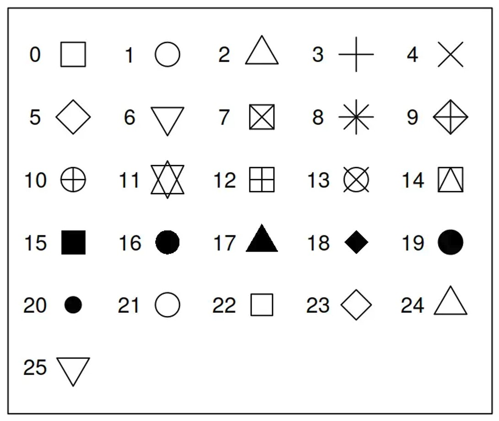

# **Class 9: Data Visualize, Rbase Plot**

# Why we need to plot something out?


Visualization is a powerful way to convey the ideas and findings of your
research or to present data effectively.

1.  Clarity

2.  Engagement

3.  Patterns and trends

4.  Memory retention

5.  Storytelling

6.  Comparison

# 1. Basic plot

## 1.1 Read data

``` r
Excerdt3 <- read.csv("E:/Drive/2_lab/Edu5_Course/R_MyFirstLesson/R/9_DataVisualize_RbasePlot/Attachment/Excerdt3.csv")
```

## 1.2 Histogram

``` r
hist(Excerdt3$Precip_value)
```


``` r
hist(Excerdt3$Precip_value, main="Precipitation frequency")
```


``` r
#You can't do the things like this
#hist(Precip_value, main ="Precipitation frequency" ,data= Complex_long)
```

## 1.3 Scatter plot

``` r
plot( x=Excerdt3$Z,y=Excerdt3$averageT_value)
```


``` r
#give some color
plot(Excerdt3$Precip_value,Excerdt3$averageT_value, col = Excerdt3$station)
```


``` r
#change the type of point
plot(Excerdt3$Precip_value,Excerdt3$averageT_value, col = Excerdt3$station, pch=3)
```


Here are different types of the point, change the types of the point
with the numbers.



``` r
plot(Excerdt3$Precip_value,Excerdt3$averageT_value, col = Excerdt3$station, pch=20)
```


``` r
#cex -> control size
plot(Excerdt3$Precip_value,Excerdt3$averageT_value, 
     col = Excerdt3$station, pch=19 ,cex=0.5) 
```


``` r
#give it a title
plot(Excerdt3$Precip_value,Excerdt3$averageT_value, 
     col = Excerdt3$station, pch=19 ,cex=3, main="This is a title") 
```


``` r
plot(Excerdt3$Precip_value,Excerdt3$averageT_value, 
     col = Excerdt3$station, pch=19 ,cex=3, main="This is a title", 
     xlab="Precipitation (mm)", ylab="Average temperature (C)") 
```


## 1.4 Boxplot

``` r
boxplot(Excerdt3$Precip_value~Excerdt3$station)
```


## 1.5 save your plot

``` r
png("Excercise_output/rplot.png", width = 5000, height = 5000,res=1000)
plot(Excerdt3$Precip_value,Excerdt3$averageT_value, 
     col = Excerdt3$station, pch=19 ,cex=3, main="This is a title", 
     xlab="Precipitation (mm)", ylab="Average temperature (C)") 
dev.off()
```

    ## png 
    ##   2
